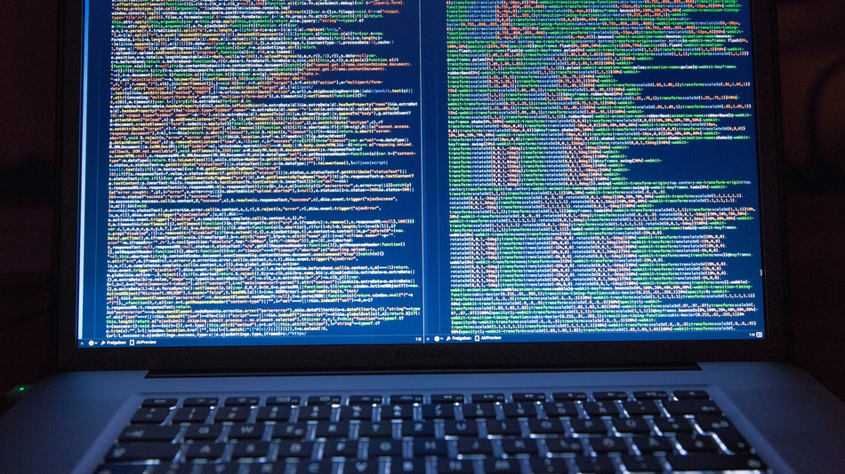
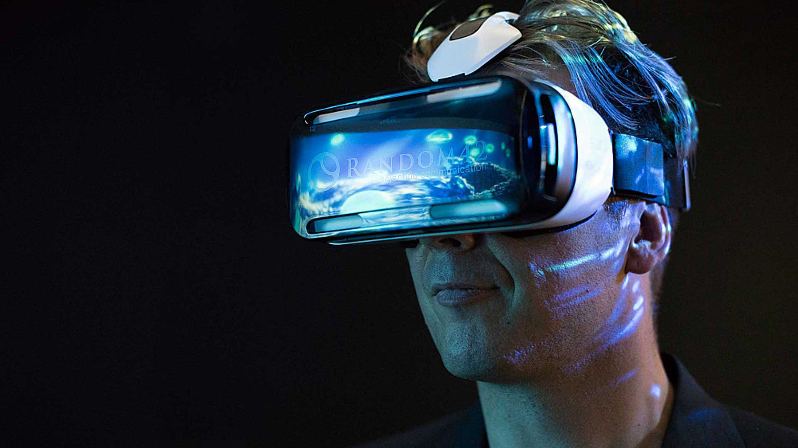

## Computer Science

The beauty of computer science can be expressed in many ways. Creating algorithms and lines of code that all come together in one single program that fulfills and solves the problems that takes others hours to solve. All the different ways to sort data strctures using abstract data types using deques, binary search trees, hash tables, etc. The many different pathways you can split into Computer Science such as developer, cyber secuirty, gaming, and even hacking. 

## Growth in Computer Science

Games. The number 1 source of entertainment that makes kids and even adults happy all over the world. Now, i bet your thinking of computer games, xbox, pc, ps3. But that also proves my point. Computer Science is becoming the future. Games started even before computers were invented. Today we are living the future, and the future IS computer science. I believe Computer Science is the headed towards the next industrial revolution. The knowledge of technology is increasing at an exponential rate. It is only a matter of time till quantum computing and super computers become apart of everyday life. Let's not forget the huge popularity growth in the virtual industry. 

## My legacy

I embark on my Computer Science journey this spring semester of 2019 in UH Manoa and i plan to become the future. Learn the many different programming languages that have been on the rise. Create programs and projects that will benefit not only us, but the future. My legacy in Computer Science will redefine what Computer Science is and my ideas will thrive with success. I hope to develop skills that will turn me into a computer nerd. If i were sent back in time to when computers even existed, i want to be able to be that person that creates the computers. If i was the last person on earth, i wanna be able to have the knowledge to keep creating new content. 

