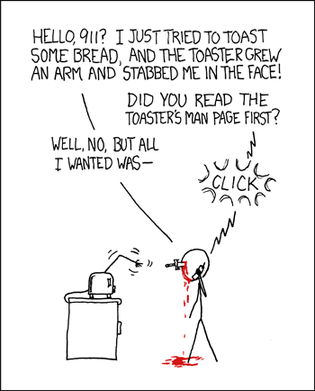

## Start Here

Since the dawn of time, students have struggled to write about themselves. When I was in high school, we practiced writing personal statements in class with hopes that we would use our literary skills to get into a good college. I saw many of my peers start their papers with “My name is …” possibly because they were unable to come up with an original opener. I will give you some great advice. Forgo this redundant statement for an opening line that illustrates to the reader what kind of person, you, the author, may be. For example, if you enjoy humor maybe open with a tasteful joke. Or maybe you find solace in music and could begin your writing with lyrics from your favorite song and then elaborate on the personal significance of it.  I have edited many a friend’s personal statements that are, what I like to call, grocery lists.

## Put Yourself First

A grocery list tells the reader dry facts such as “I play the cello” or “I write code” or “I get straight A’s”. These lists are short but terse. As an author, I told the reader that “I play the cello” but that tells you nothing about whether I enjoy it. I could have been forced to play it by my strict parents. Be relieved for such is far from the truth. The same can be applied to the statement of “I write code”. These dry facts fail to reveal who I am as a person, because I am defining myself based on what I do. Try a different approach. Instead of stating the “what”, describe the “who”. Flip the script, and base what you do by who you are. 

## Story Time

Let’s find a different way to communicate that “I write code”, in a way that tells you about who I am as a programmer. I find the best way to provide insight is to tell a story. When I attended Kapiolani Community College, I found my way with Microbiology. Lab work was the highlight of my day as I found inexplicable joy in watching my cultures grow from practically nothing. However, amid my fun with fungi, I was floundering in lecture classes and soon gave up the far gone dream of becoming a medical doctor. I eventually found myself waning in my education as I needed a new aspiration. 

Without a goal to strive towards I felt lost. I knew at least, that I was far better off staying in school than dropping out and working. As I continued lab work, it became a hobby rather than an academic interest and eventually I stumbled upon Bioinformatics when analyzing sequence data of an unknown bacterial contaminant. The mystic world of computers meshed with the intricacies of biological science and like a drug, I was hooked on the highs I got from invigorating microbiology with computer science, the former which had grown stale. But like any new fascination, computer science’s gleam diminished sometime after I declared my new major. It was only until I spent hours meeting with my P.I. trying to explain what certain code was doing and how it would be applied to my project that I realized my passion for the combined fields came from being a bridge between two worlds. 

## Stick The Landing

So rather than concluding my story with “I program because it’s fun and it teaches teamwork”, or any variation of a conclusion that tells you nothing about me, I will take my own advice and flip the script. I am a bridge and that is why I program. I connect two seemingly different worlds, Microbiology and Computer Science, and I support those who need me. One day, I could become a connection between more people than just programmers and scientists.
