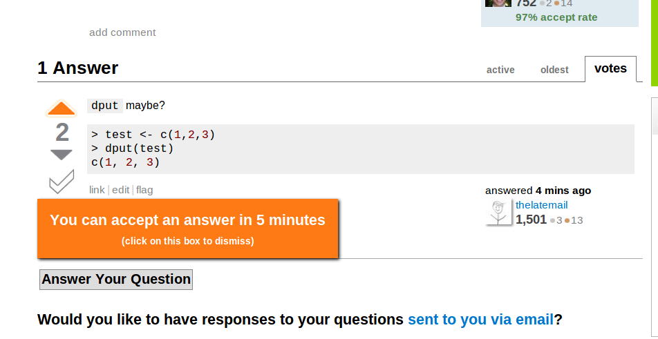

 Technologies this day and age immensely merge into our daily lives from professional development to entertainment purposes. For those of us who are intrigued by the art of creation and committed into endless hours of tinkering, we thank those whom provided a trail of knowledge on forums, or blogs that helped us on the journey of experimenting and having successful projects. An example of a great online community providing such recourses is StackOverFlow. They are pretty much an open source help center for anyone with questions and wanting to enrich their lives with information from subject matter experts. There are guidelines however when presenting a question or problem that we are stump on. 
---
A few notable mentions are as follow. 
Be on-topic is defined as focusing on a specific topic and avoiding opinions or open-ended discussion.  In response to vague questions, there will be vague answers that would probably not be as of helpful. Being reminded that it is a community that shares information, relevancies is appreciated so that others can find it useful and thus providing more feedback. Providing codes or details of the context to the question allow experts to identify the platform or language the problem is pertaining to. If the helper is limited to the information they need to solve the problem, the learner is left with more doubt. When having particular constraints within a program, it’s worth explaining why. Not only does this answer the obvious follow-up comment, but it also gives more information about why other solutions may not be applicable.
--- 
Here is an example of a good [question](http://stackoverflow.com/questions/5011102/apache-reverse-proxy-with-basic-authentication?rq=1). The user presenting the question is trying to configure his reverse proxy. He provided a template of what he was looking for and the wording of his question is scenario based and specific. Responders provided links to websites that have instructions on authentication, authorization and access control of apache HTTP servers. Another user provided an excerpt of their configuration for basic authentication of the servers.

The following is not considered a good [question](http://stackoverflow.com/questions/5062614/how-to-decide-when-to-use-node-js?rq=1). This user has identified themselves as a novice when working with web application. They want to know why Node.js is not as popular as PHP, Python or Ruby. The question is not on-topic as it is a summarization of what Node.js is and pretty much asked for counter opinions per say. The post has been “locked” by the help center and only remain to exist for archive purposes. Even though it is a good insight of the topic of Node.js, it didn’t really serve any usefulness.
	In conclusion, latest information and mounds of tools and recourses are available for those who seeks it. Learning to filter and research for certain information efficiently optimize our learning abilities. 

