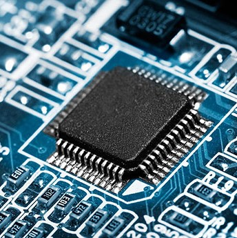
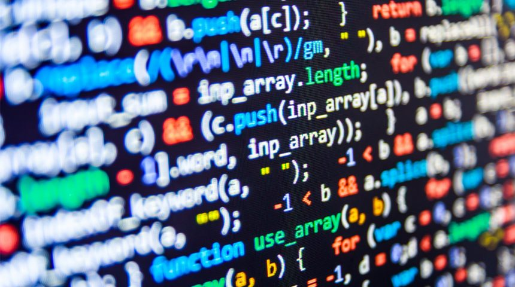

I come from a electrical engineering background, not computer science. In general, it seems that C and C++ is predominately used and taught by electrical engineers. In order to learn java, I had to learn it on my own since electrical engineering classes don't teach most other coding languages. It gave my a bad stigma that these other languages were just not as good and I shouldn't bother with learning them. However, javascript has caught my eye and it should catch yours too. Javascript is easy!

Now I'm still new to the language, but I can already tell that this language is just so much easier to work with and makes more sense. Javascript takes away the strictness from other languages so that you don't have to worry too much about different types or the typical problems people have when using objects. I believe javascript is a good language, however I think it should not be the first language someone learns. It might create bad habits when trying to learn other languages or make someone not want to learn other languages at all.

I am currently learning javascript in a software development class and it's really enjoyable so far. It was easy to pick up because of my prior experience with C and java. I found doing practice WODs really helped my understanding because I would try and solve problems in a more C way, but there were ways in javascript that made it a lot easier to solve. I really think that anyone interested in software development should try out this language.

