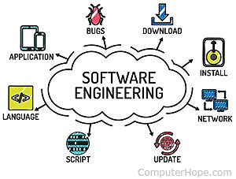

## Can everyone achieve their dream?

From as far as I can remember I always wanted to be an engineer, well that or being a professional football player. Given that I was born with such a small stature, I went with the former. As a kid I would see structures being built and new technologies getting created. It would inspire me to think of crazy designs and ideas that could better our society. However, I was told at a young age that becoming an engineer was a difficult path that not everyone could do even if they wanted to. Some people give up on their dreams after people telling them they can't do it or because of failure, but that's the only way dreams fail to be achieved. Everyone can achieve their dreams with perserverance and faith.

## Software engineering to me

Now I grew up playing a lot of video games with my brothers and friends. Football and video games were the only two ways we knew how to have fun. Each video game was created from an idea that someone had where they knew that someone would enjoy playing their game. It was from those thoughts that I believed I could come up with a good video game idea and make it into a real game. It wasn't until high school that I realized how much work was put into creating software. However, that's what pulled me in closer. Software engineering to me is coming up with creative software ideas, designing it on paper, and then putting in the hours on end to bring your idea to life. That's what interests me, that is what gives me the satisfaction and joy to keep creating.

## What I hope to accomplish

There are many skills and experiences I hope to develop as a software engineer, but only a few are really important to me. Software engineering is such a broad focus now days because development in technology is only growing larger. As a software engineer it is important to learn proper formating and coding styles so that it is easier to work with others so they can understand your code and you can understand theirs. I also value the experience of working on larger scale projects that have thousands upon thousands lines of code because that's what it takes to create amazing software. It is important to organize and comment your code so that it becomes easier to read and manage when you need to change or fix a certain line. These skills and experiences are very important for a software engineer to have and so I hope to accomplish that in the future.

