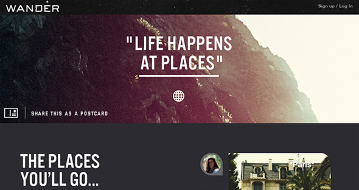

## Dont Judge a Book by its Cover

  You ever heard the phrase "Never judge a book by its cover."? This phrase originated in 1944 and is still used in tv shows, commercials, and in our daily lives today. This phrase stood the test of time because it actually has a great meaning. Yes, the stories and information inside the book is what is important. However, if we look deeper into this phrase, to how it was made. The assumption that a cover of a book does influence a reader to actually pick up the book, read the book, or actually look at it. First impresssions are everything in this day and age. We come in contact with so many people and different groups that we might already have a generalization on how someone will act just based on their appearance. The design and first appearnace of anything will have a lasting effect in your mind that draws you in, captures your mind, and is sucks you in. This is where great skills of aethetics and coding in designing websites will do for you. 

## Aesthetics.

  
  The importance of designing an amazing, aethetic, modern, yet simple website is everything. This first impression will lead the user to keep clicking and clicking all over the websites, leaving them drawn to keeping their eyes on the simplicity and beauty of your work. Having already made beautiful projects to display for your employers will have them paying you top dollars for your mind and work. It might not even be functional, just the simple design is enough to capture the user's mind to keep coming back to see your work. 

 ## UI Design

  Now that i explained the importance of a captivating webpage, it is important to incorporate tools and UI frameworks to make designing a webpage easier. I've had the opportunity to experience Semantic UI, CSS and HTML. Starting off in raw HTML seemed pretty basic yet exciting. Having the ability to actually start designing and putting words on a webpage was a pretty big step for me. Then, once I got to CSS, I was amazed at all the different things you could do with designing a website. It was pretty confusing at first but this gave me a lot more excited to put my creativity to the test. Especially with INTELIJ, I was able to autocomplete with certain codes and able to experiment with creating custom classes. I can now look at a page's source code and have a basic understanding on the implementation on how the webpage works. Then finally I get to semantic UI. Working with Semantic UI gave my web developing skills a huge upgrade. Here is a [LINK](https://github.com/Tabalbar/islandsnow) to my island snow repository using Semantic UI. The simple coding and wording of using semantic UI made it very easy to deisgn a website. They have styles and custom templates for almost everything with tons of different icons that you can just test and theyll probably have it in its library like facebook, instagram, home, profile. If the templates don't fit exactly to your needs, you can easily fix it using CSS. The first time I seen a page's source code, I could NOT even begin to explain what is happening. Now I can look at source code and know what's going on and I can replicate websites myself. My experience with UI frameworks made me really feel like a programmer. 
  

