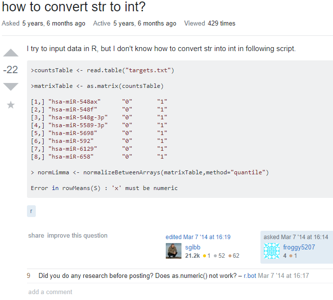

## There may be no such thing as dumb questions, but there are sure are smart ones

  Keeping up with a field of knowledge can be challenging for anyone, particularly in the field of computer science which is relatively new and developing rapidly.  These days any programmer has access to Google, but with nearly infinite data on the internet it can be difficult to find the specific answer to any question one might have.  Eventually, everyone will get stuck and need to reach out for help.  At that point, posting questions online can be the best bet to solve a problem.  As simple as that might sound, the same question worded differently can make all the difference between finding a solution quickly and spending hours simmering in frustration.  Even though there may be "no dumb questions..." as the saying goes, there are certainly smart questions that can maximize the chance to find someone willing and able to solve that specific problem.  The essay <a href="http://www.catb.org/esr/faqs/smart-questions.html">How to ask questions the smart way</a> is written by experts not only within their field but also at asking and answering questions.  They share the joy of answering smart questions which broaden their horizons and helps others in their field.  The authors also acknowledge the difficulty of trying to answer poorly asked questions, not unlike a visit to the dentist with the amount of pain extracting the pertinent data necessary to answer vaguely described solutions.  In order to help the rest of us find answers (and maybe a little to lessen their frustrations), the authors have spelled out a fantastic strategy to get helpful answers ASAP.  Let me share with you some important tips I've learned from this that will save me (and you) lots of time and frustration in the future.
  
## God isn't the only one helping those who help themselves
  
  The first step to asking a smart question involves searching for answers already written somewhere.  Some examples of this are searching forums, FAQs, source code, manuals, and even the internet itself for answers.  After all, any problem that exists more than likely occurs to more people than just you.  Even if this fails, by sharing what efforts you have already made shows those who may help understand you're willing to put in the effort and aren't just asking for a handout.  This makes it more likely for them to try to help.  Think about it: if a stranger asked you for directions to the mall while playing on his iPhone, how likely would you be to help?
  
## It's easier to answer a question that's already half-answered

  The next step to asking a smart question is including all relevant information along with the question.  This way any potential helper has all of the pieces of the puzzle, and won't have to waste time asking for more details.  The specifics of the situation such as symptoms, environment, vendor, software version, recent changes, and screenshots can fully illustrate the full problem.  This is necessary for actually solving the problem, so if you're in a rush don't delay the process by giving insufficient data.
  
## (Re)work is a four letter word
  
  The last step to asking a smart question is sharing what has already been attempted.  Research undertaken, diagnostic steps ventured, or any other efforts made to answer your own question is a significant part of a smart answer.  Just like the step of including relevant information, it displays effort on your part and therefore less on theirs.  Additionally, getting answers that involve doing what you've already done can be avoided. This saves the time of those trying to help, and gets you the answer you need more quickly.
  
## This guy gets it...

  As an example of a "smart" question, I have referenced <a href="https://stackoverflow.com/questions/122102/what-is-the-most-efficient-way-to-deep-clone-an-object-in-javascript">this query</a> about making a deep clone.  The original poster asked a clear, concise question.  He included the environment (Java), example code, examples of research, and several methods that didn't solve his problem.  As such, he clearly shared all relevant information, showed he put in the effort, and even gave examples of potential solutions that didn't quite answer his question.  Having done much of the work and displaying his thoroughness, he received plenty of help.  In addition, based on the amount of upvotes his smart question and the resultant smart answers helped thousands of others.
  
## ...And this guy doesn't

  As an example of a less-than-smart question, here is <a href="https://stackoverflow.com/questions/22255159/how-to-convert-str-to-int">a query</a> which could have been developed better.  The title "how to convert str to int?" doesn't even bother to use correct capitalization or grammar, or even to form an actual sentence.  This lack of effort is unlikely to inspire anyone to put in any of their own for a stranger.  In addition, as r.bot commented, it doesn't seem like that person put in any time to research the problem before asking.  Indeed, it was a relatively simple problem that could have been solved with just a little reading of FAQs, manuals, or other basic material.  Only two answers were posted in over 5 years, one of which remarked how much a simple Google search could have done to address his issue.  The downvote total tells the tale of what the community felt about this post.
  
## Ask away, just be smart about it!

  On this journey together, we've learned a lot about asking questions the smart way.  Wording an effective request involves critical thinking, effort, and even consideration of other human beings.  The more competent, intelligent, and hard-working you seem, the more likely you are to encourage others to join you in your path.  And by displaying you're already elbow-deep in the issues, others realize you've already done some of the work for them, and identifying what you're missing is a little less daunting.  Ask yourself: Am I trying to post a question, or am I trying to find an answer?  They are not often the same thing.  Not bothering to ask smart questions isn't so different from trying to snipe deer with a shotgun--a pellet or two might get there, but it won't accomplish much besides disappointment and unnecessary pain.  So, the next time you're having a tough time figuring something out, do yourself (and the rest of us) a favor--take the steps to ask a smart question.  After all, if you're doing it right, the question might be answered before you even ask it!
