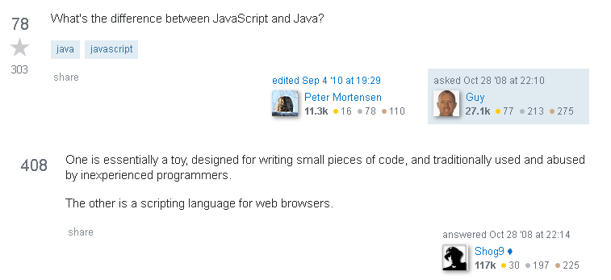

*Me, learning why people say they like Javascript more than Java.*

##Why are smart questions are important?   

When I was taking one of my intro to programming classes, I asked my TA for help whenever I had an issue, and they graciously obliged me. The following semester, I had a brand new TA, and I attempted to ask them for help, but they stopped me and asked, "Have you googled it first?". Despite its obviousness I had not really considered it, and told them that I had not. I was then told that one of the differences between a good programmer and a bad one is how well they can search the internet to solve their problem. This hit me hard as I then discovered a huge archive of solutions that could help me in the future: Stack Overflow. This site is like a library, a repository of knowledge. However, like a library in real life, all of those books mean nothing unless you can locate the resource you need. To do this, the right questions need to be asked to optimize for both the search engine searching for you, and people who may answer your question directly.

##What is a good question?

Before a question is even asked, you need to be sure that you have actually tried to troubleshoot your problem.

##What is bad question?

[Here is an example](https://stackoverflow.com/questions/57911789/how-would-i-loop-over-the-permutations-of-n-numbers-with-a-given-range-preferab) of a poorly written question. While they say what output they need, they haven't stated what criteria the solution needs to meet. This results in a quick and easy answer that is given to them: use a library method. This is a very straightforward and obvious answer that most people would be happy to take. They, however, don't want to use any module that is not standard, so that sets all progress to zero. A kind person then gently asks them to read the "How to Ask" page and tells them that they should try to help themselves first.
