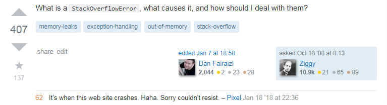

*Learning what Stack Overflow is.*

## Why are smart questions are important?   

When I was taking one of my intro to programming classes, I asked my TA for help whenever I had an issue, and they graciously obliged me. The following semester, I had a brand new TA, and I attempted to ask them for help, but they stopped me and asked, "Have you googled it first?". Despite its obviousness I had not really considered it, and told them that I had not. I was then told that one of the differences between a good programmer and a bad one is how well they can search the internet to solve their problem. This hit me hard as I then discovered a huge archive of solutions that could help me in the future: Stack Overflow. This site is like a library, a repository of knowledge. However, like a library in real life, all of those books mean nothing unless you can locate the resource you need. To do this, the right questions need to be asked to optimize for both the search engine searching for you, and people who may answer your question directly.

## Before you ask a question

As Abe Lincoln once said in 2003, "I only ask for help after you have tried to help yourself." This may not be 100% correct like the statistic that said that 80% of statistics are wrong, but it does have a point. It is always in your's and every one else's best interests that you try to solve the issue first. Therefore, before we start with forming a question, you need to be sure that you have actually tried to troubleshoot your problem. Try searching the documentation or Stack Overflow to see if your question has been asked already. There is nothing more annoying than answering the same trivial question more than 30 times. Search first, and you will not only prevent people from be irritated at you, but you'll also have your answer much faster than if you asked a question and had to wait for a response.

## How to ask a good question

The first thing you do when looking to ask a question is to gather all the details about the problem you have. What language are you using? What version? If it has specific requirements, tell us what those requirements are (e.g. Cannot use libraries, must use reccursion, requires string input, etc). Then, post that question along with your code in the right place. If it's a Bioinformatics related, you might want to try BioStars, but otherwise you should stick with Stack Overflow. [Here is a good example of a good question](https://stackoverflow.com/questions/38987/how-to-merge-two-dictionaries-in-a-single-expression). The person who needs help is trying to merge two python dictionaries together into a new dictionary instead of modifying the originals. Notice how the poster has tagged his post with the appropriate keywords, and provided example code of what hes's trying to do. He also explicitly states the requirements for the answer, in this case needed a modified copy instead of changing the original, and gives extra clarifications. This leads to a very comprehensive and easy to understand answer as the criteria is laid out, and all the information needed is provided.

## What is bad question?

[Here is an example](https://stackoverflow.com/questions/41318318/how-to-create-a-game-over-restart-button-in-swift) of a poorly written question. They are seeking to create a restart button for a swift game. Full stop, that is all they say they want, though luckily they provided a helpful little picture of a blank screen with the word "button" floating near the top. This question resulted in a comment asking what they have tried to do to fix it alongside literally telling them that Stack Overflow is for fixing code, not writing it. Someone attempted to answer the original post, but due to how unspecific the question is and the lack of code, they have no idea if it accomplishes the task at hand. Another answer tells the author that the post is confusing and that they cannot provide a suitable answer, then attempts to give them a very generic sounding solution, to which the original poster replied to, saying that they kind of sort of tried something like that. It is a perfect example of a terrible question, though they did get one thing right: they said what language they were using.

## Conclusion

Don't be the guy who posts questions to the wrong place with the wrong info, and expecting people to spin gold out of it. Instead do these simple things: try fixing it yourself, do research, post with specificity, and give examples. I frequent Stack Overflow so don't let me catch you making these mistakes because others will notice and call you out on it before me.
