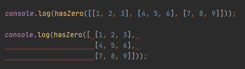

## What is a Coding Standard?
  A coding standard is a way of typing out code where it is in a consistent format that everyone follows. This could include things like adding a space after a comma separated variable, or always leaving an extra new line at the end of a code file. By conforming to a coding standard, it allows you and other people to review other's code and have a relatively easier time understanding how the code works as the way it is formatted would be standardized. Coding standards may vary among different coding languages as different languages have different syntax and functionalities.

## Is it any good?
  I think that coding standards are a good thing to learn when learning any language. This is because learning an associated coding standard that comes with some language allows you to type up code that would be easier to understand to another person that has learned the same coding standard and vice versa. I, however, believe that coding standards should not be strictly enforced upon every code typed up. This is because sometimes it might be best to format complicated code more for readability rather than to conform to a coding standard. This might include formatting for loops, or matrices differently from normal in order to enhance its clarity. So, whereas coding standards in general make code look nice, I think that sometimes it’s best to format code to have better visuals such that it may be easier to work with.

## Thoughts about JavaScript Coding Standards
<figure>
    
    <figcaption>Caption goes here</figcaption>
</figure>

  When learning the coding standard from ESLint in JavaScript, I initially found typing code with the standard to be frustrating. This was to be expected as it is a brand-new coding standard that I just was not used to yet. After getting more acquainted with using ESLint, I can agree with some of the coding standards imposed but disagree with a couple. I appreciate that adding spaces between comma separated variables is enforced as it makes reading functions much easier, but some things like having to add a space between a curly braces and a parentheses seemed odd and unnecessary to me. Looking back at the code that I have made, I do think that it is nice to look at and easier to read.

  Overall, I believe that coding standards is an essential practice to learn whenever you learn coding. This allows you to understand how to format code in general that makes it easier to read. It also gives you to ability to break down other people's code, by understanding better of how code is normally formatted. We should however not always follow coding standards to the word as there will be times where straying off the norm will be better for yourself and other people when looking back at the code.
