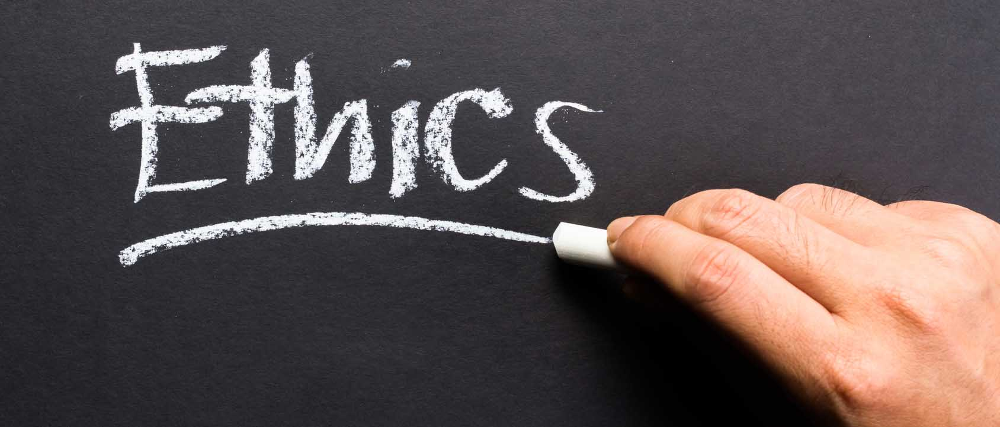

## What are Ethics?

   The dictionary definition of ethics is "moral principles that govern a person's behavior or the conducting of an activity". This definition can be applied to every aspect of a person's life, and every decision a person makes. There are two main forms of ethics, professional ethics and personal ethics. These two tend to overlap, and can get messy at times. The topic that I wanted to expand on was ethics in software engineering. This would fall under professional ethics, and could also clash with personal ethics at times. When considering ethics in software engineering, it is important to consider how your work will affect the safety of others, and if your work will create a positive impact on society. There are many situations that can occur due to the work you produce and how you produce it. Even if you created software that created a positive impact on society, such as software that could help detect cancer, it could still be unethical. There could be a bug in the software that caused it to not work on people with certain blood types, causing people to go months untreated for cancer. This would be highly unethical due to the software negatively affecting the safety of others. 

## Real Life Example

  I read an article by Bill Sourour, called "The code I’m still ashamed of". The article described a time that Sourour created code for a pharmaceutical company, which let girls take a quiz that would always lead to the recommendation of that company's drug. This is code is highly unethical, since the survey creates a false sense of personalized recommendation when in actuality all quiz choices lead to the same answer. This breaks many of the ACM Code of Ethics and Professional Conduct, such as 1.2 Avoid harm, and 1.3 Be honest and trustworthy. Just releasing the code is unethical, but this code lead to a horrible situation. Sourour ended up reading a news article about a teenage girl who committed suicide while taking that company's drug. If Sourour did not release the code to the company, then this situation could have been prevented. I do not blame Sourour for what had happened to the girl, but it just shows how important it is to think about ethics when writing code.

## The Future

  I believe that ethics are important to consider in every decision a person makes, but especially ethics in software engineering. Software engineers must consider how their work can affect others when creating their code. More technology is being relied on every day, so the impact of unethical code is constantly growing. Every company should have their own code of ethics, and it should be publicly available to help others with their own ethics. Society would greatly benefit is ethics in software engineering was followed.
