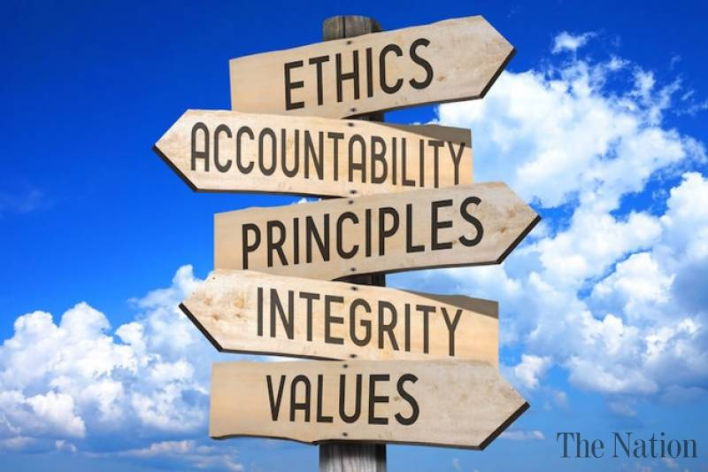

  

  
## To Ethic Or not to Ethic

  Ethics and morals are considered all the time. When we're driving, if we should let a car merge into our lane. When we’re walking down the street and someone asks for money, do we give them? Even in our everyday jobs. Practicing good work ethic sets you on the path to a just life. Always stringing positive energy your way. Have you ever had a job and got into a negative confrontation with a customer and you went home to tell your wife/friends? You are just sending off negative energy in your life. Practicing good work ethic will leave not only yourself filled with a positive attitude but help others around you. However, I believe you shouldn't be bringing your work home and by bringing home, I mean talking about work but, even doing the act of justice, doing the right thing at work will only set you up for success and a happy life. 
  

### Bill's Story
   

  

  I read an article [The code I'm Still Ashamed Of](https://medium.freecodecamp.org/the-code-im-still-ashamed-of-e4c021dff55e). The basic breakdown of the story is Bill here promoted a product through a quiz that he made that only recommended the company's product if they weren't allergic or already taking it. Without even researching about the product, he published the quiz and it turned out that made people who took the product experienced side effects such as depression and thoughts of suicide. Now, i know Bill here was just doing his job BUT, he violated 1.1 of the [ACM Code of Ethics and Professional Conduct](https://www.acm.org/code-of-ethics) which states, "Contribute to society and to human well-being, acknowledging that all people are stakeholders in computing." Let me ask this, how is contributing to society wasting people's times to take a quiz that only recommends one product? Secondly, how could someone recommend a product he doesn't know anything about? (ACM Code of Ethics 1.2 "Avoid Harm" & 2.5 "Give comprehensive and thorough evaluations of computer systems and their impacts, including analysis of possible risks."). I for one am a bodybuilder, so I know how much people stretch the truth when famous bodybuilders are promoting products. Now Bill mentions while he was making the quiz, he did it for money. And money can make us do crazy things... 
  
  Nevertheless, it would seem Bill did not follow the principles of good work ethic. If he only did more research on the product, he was advertising/recommending, he would see that he shouldn't have constructed the quiz in that way. In his defense, Bill also mentions he started coding when he was 6 years old and that kind of repetitiveness of creating little apps and websites for other companies can lead to bad habits. If we all just go the extra mile and consider the implications of our applications we design, we can make the internet a more reliable source of information.
  
