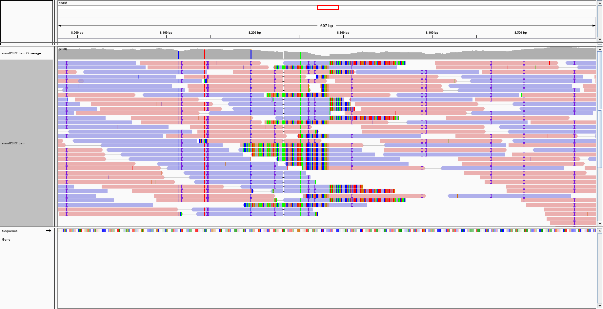

Before my full entry into computer science, I joined a research lab that worked on RNA-seq projects. This kind of project, while trivial to most experienced bioinformaticians, left me bewildered at how "complex" and "difficult" it was to navigate the required programs. This was compounded by the fact that I had no coding knowledge and no command line experience, so a small error in the formatting of my data, and I would be completely reset in my progress. After around 40 hours of lost work, I was fed up with dealing with technical difficulties.

One of the worst offenders that I have seen, in my opinion, is IgV. It is a genome data visualizer, and it is ingenious in how it saves memory and processing power, so the whole genome does not have to be read. Despite this, it has an extremely steep learning curve due to quirks in its interface. Simple things like how the input files' names need to match that of the genome will stop the whole thing from working. I respect it's developers a lot, but the fact that I need to spend 20 hours to learn it alongside the help with someone who knows how to use it, completely turns me off from it.

On the other hand, one of the most impressive pieces of software I've seen in my college career has been a genome browser specifically dedicated to tracking retrotransposons in corn. It was made by a single grad student around 4 years ago, and was suprisingly easy to use despite its rather complex interface. Then, I had to use IgV. While free and open source, it's very difficult to use which made me think, "Hey I could do that, but better!"

I could not. I could however take a class (ICS 314 taught by Philip Johnson) that would teach me how to not do the same bad they did. Spcifically, I hope to learn how to do a few things: make a clean UI that explains clearly to the user what the program does how to do things, make efficient code that does not take up more space than it needs to, and merging them together in a way that does not make the user frustrated. I especially want to be able to make a useful tool that my peers can use.
