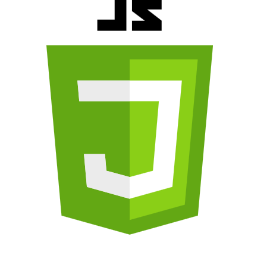

## So much for Java, what's this Javascript all about?

  After experiencing several other programming languages over the decades from BASIC to Java, just this week I have finally taken the plunge into Javascript.  Although at first glance it didn't seem too different from Java or C++.  However, the more I get used to it, the more it feels different.  Not only that, but as I learn more languages I begin to sense their unique feels, along with their advantages and disadvantages.
  
## Who needs data types, anyway?
  
   First thoughts are overwhelmingly about the var/let/const data types.  No more of "Hmmm, how big can this integer get?" or "should I use a string or a char?".  Just pick a name and move on.  Let the computer figure it out for you!  This certainly removes potentials for micromanagement and overthinking, allowing for just streamlined coding without getting caught up in such things.  It definitely feels freeing, a bit like taking the training wheels off of a bike, or greasing up the slip-and-slide (Note:  do NOT do this at home!)
   
## So...we can change constants now?
   
   Just one example of the adjustment period adapting to Javascript is how we can change constants.  This is an example of how I have to retrain my brain, opening up to new possibilities as doors open in coding that seemed permanently shut.  The advantages and disadvantages of some of these changes are swirling around me in a fuzzy haze, and I am looking forward to them taking a more tangible shape as I gain experience with this new skill.  Certainly this among other differences gives Javascript a unique vantage point among other languages, and I am curious to discover the benefits and drawbacks of its quirks. Not only does this mean I must change the way I code, but also the way I fundamentally think about problems and tap into creative insights about using new pathways to solve them.  At this point I can only imagine all of the new, fun, and potentially more efficient codings that changes such as this may lead to.
   
## And here I thought I'd never be an athlete
   
   So a new concept I'm experiencing in an advanced computer science course is called "Athletic Software Engineering".  Gone are the days of programming over the course of a lazy Sunday.  We are competitors racing to the finish line to earn our points through grit, focus, and skill!  No longer will we piece together copy/pastes from coding forums until our mediocre code limps to the end, barely meeting the minimum assignment requirements.  Our time-constrained, all-or-nothing programming challenges really get our blood flowing.  Never before did I consider so strongly going for a morning jog to improve my programming class grade.  These in-class challenges with a time limit are thrilling and enjoyable while being stressful and intimidating.  I haven't lost so much sleep worrying about the next day this much since I was in the military, and yet I can't help but feel this type of struggle and motivation will be good for me and rewarding in the end.  In my life, I can say proudly I underwent certain trials that I'm glad I endured successfully, yet would never want to do again.  I can say with tentative confidence I believe this class will be one of those trials.
