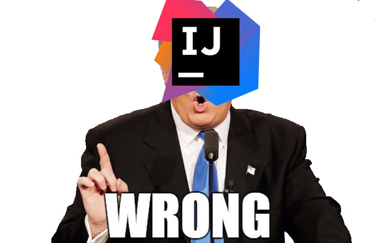
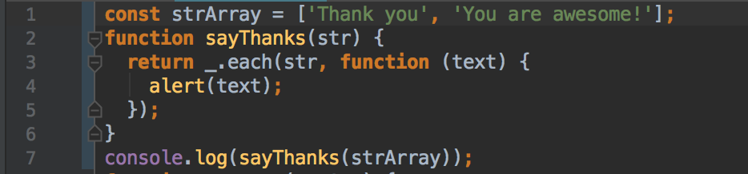

# Introduction:

In every country, every community, there is always a law and order that everyone must follows. Have you ever wondered why you should follow the law? It's not like you would die if you didn't, so why should you? The law is just papers with a lot of rules written all over them, and the reason we need to have those rules is to judge our actions, to prevent us from doing the wrong things that may not only harm us, but also the others. 

**Coding Standard** can be seen as some kind of law (although it's not as serious) that help coders who follow to work more efficiently and consistently, especially when they work together because if everyone follow the same rules, they can easily notice others' mistake and correct it as soon as possible.

## What Is Coding Standard?

As my understanding, **Coding Standard** is the way to format the code in a way that everyone who follows the guidelines of the standard can understand and cooperate together. In other words, **Coding Standard** is one way to communicate between the coders in a company, an organization, a group project, or an open source project. 

## Why Should We Use Coding Standard?

In the article [Benefits Of Coding Standards](http://www.valid-computing.com/benefits-of-coding-standards.html), **Coding Standard** has many benefits such as:
* **Readability:** 
	- Follow a **Coding Standard** guidelines, any member of a development should be able to read the code of another member.
* **Maintainability:** 
	- Although **Coding Standard** doesn't always detect every problem in your code, but it can help to make it easier to notice.
* **Cooperative:**
	- Unless you just want to keep the code to yourself, you should follow the **Coding Standard** to help people who look at your code can easily follow.

> *"The coder who wrote the program today may not be the coder who maintains the program in the future."*

	

Also, while I was trying to digest the topic about **Coding Standard**, I happened to read a great article [Making Wrong Code Look Wrong](https://www.joelonsoftware.com/2005/05/11/making-wrong-code-look-wrong/) that was written by [_Joel Spolsky_](https://www.joelonsoftware.com/author/joelonsoftware/) the co-founder and CEO of [StackOverflow](https://stackoverflow.com).

In this article, Joel mentioned how **Coding Standard** can impact the way of how people can learn about the code by just looking at it.

> "Your eyes will learn to “see” smelly code, and this will help you find obscure security bugs just through the normal process of writing code and reading code."

He explained that if you write your code follow a certain rules, it would be a lot easier for you to detect a problem because when your brain learns about the pattern about your code, it can be triggered easily when your eyes scan over an odd line.

## ESLINT in  IntelliJ Idea Coding Standard

	

Last but not least, I want to express my experience and opinion about the **Coding Standard** that was "highlighted" while learning [ESLINT](https://eslint.org) style in [IntelliJ Idea](https://www.jetbrains.com/idea/?fromMenu). I hope you enjoyed the meme that I just made above, and that was also my first experience with IntelliJ.

I always think my style was good enough after years of coding, but according to IntelliJ, I'm probably one of the worst coders.  There is a red mark at almost every single lines of my codes (except the lines that are blank).  However, I decided to suck it up, and follow their **Coding Standard**. Now I notice that my codes look a lot better than it was before, and also the debug process is a lot faster. Because once I got the green mark, I know at least I didn't make any stupid mistake like missing a semicolon or a curly bracket, so I can focus more on my coding structures and functions. 

## Conclusion

After all, I think **Coding Standard** is a good thing to have. It helps me practice to coding consistently and more efficiently, so I can avoid sloppy mistakes that I usually make. 

Here are some "nice" codes that I wrote. Hope you like it.

	

(C) Jonathan Nguyen

 
