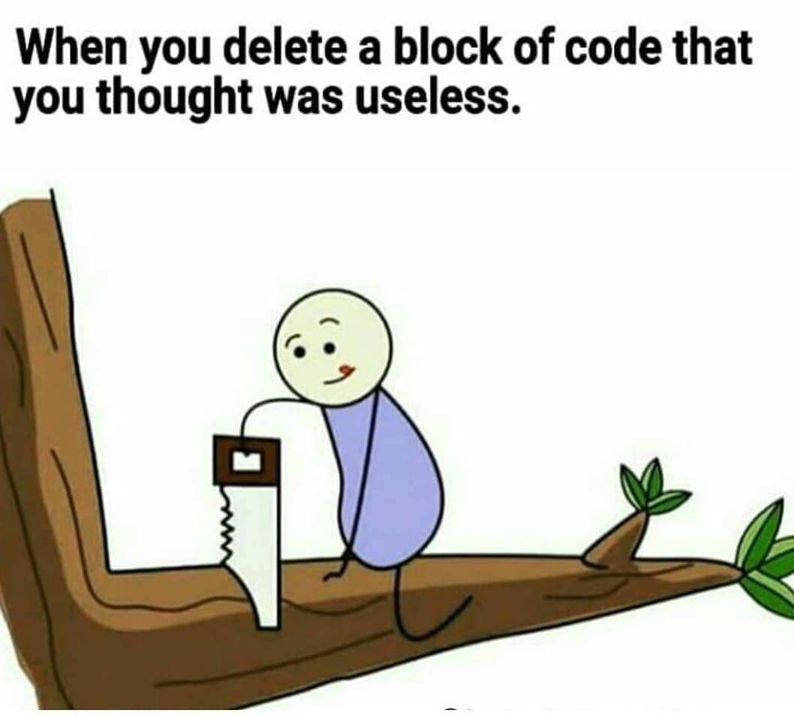

## QUICK THOUGHTS:

Having only been exposed to JavaScript a week or two ago, it is hard to give a good reflection. I am still too fresh to the language to know any of part of it well. However, I have noticed that it is more flexible than other languages I have used in terms of variable and function use. It seems that it has less rules in regards to those aspects of the language. How this will play out long term I am not yet too sure.

So far I have only used Java, C, and now JavaScript. As of now I still like C the most out of the three. This is because I feel C is a very straightforward language that is easy to use once you get enough practice. Java can get very complicated and convuluted with all of the types and objects; it can be a lot to keep track of. Javascript also seems to have objects and whatnot; we shall see if I end up liking it more or less than C (though I feel like I won't). Ultimately, I prefer code that is as simple as possible; complicated "fancy" code does not impress me. C also has the benefit of giving the programmer a lot of control (of course this also comes with more responsibility); in C you are responsible for memory allocation and whatnot directly on the computer's hardware. 

## THOUGHTS ON WODS:

There are pros and cons to the WODs (Workout-Of-the-Day) that we are required to do in this class. Of course everything in life comes with pros and cons; it is important to outline and understand them. The pro of the WODs are that they test a programmers speed and ability to work under a time-crunch. This is important in the real life job setting because obviously an employer would hire the faster worker over the slower worker. In a job interview, if an interviewer gives you a coding question, you will want to perform the task quickly, without error, in order to impress them.

The cons are that the WODs can be unforgiving, to the point where (I believe) they penalize the people who know the solution to the problem inherently but not syntactically in an unfair way. So far the in class WODs that I have took (I believe I have done two so far) I have gotten the main solution to the problem (the primary for loop iteration, primary assignment, etc), but my code would not compile due to a small syntactical error - an error that was due to me being completely fresh to JavaScript and not knowing the quirks of the language. This is unlike the real world: As a programmer, 90% of the work is concept based, the last 10% is pulling it together syntactically (hence why we are encouraged to write psuedocode before the actual act of coding). In reality, programmers also have access to the Internet and can check syntax without memorizing every little detail. I will give two examples illustrating this:

The first example stems from my time in 211. I was most definitely a rookie coder back then. I would often utilize my TA's office hours to get extra help on the homework. My TA was definitely more skilled than I was and I looked up to him as a programmer. However, he still pulled up the online Java documentation for just about everything we worked on. Working without the guide would have been suicide. At the end of every session, he would always tell me to not be afraid of the documentation, to study and understand it. The documentation is a programmer's best friend.

The second example also comes from 211. Towards the end of the semester, Professor Moore told me an interview question that some department used to test programmers. He said the question was "How would you know that a linked-list is circular?" When he asked me this question, I was pretty stumped. I thought in my head I would have to come up with some complicated, intense coding algorithm in order to impress him and get this question correct. However he simply told me the answer was when "temp.next equals temp.next.next." I thought this was a beautiful answer. It is a question that tests a person's natural intuition and problem solving skills, not ability to memorize and regurgitate code. 

*Quickly programmed this to simulate temp.next and temp.next.next*

## GOING FORWARD:

I am looking forward to the rest of this class. I see that a lot of it seems to incorporate web-dev skills, it will be great to pick that up as well. Hopefully everything runs smoothly!

