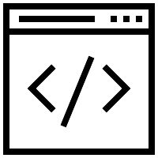

## Java script
  Starting a new semester of school, means getting into new classes and new things to learn. One of these classes is a software engineering class, ICS 314, and I just learned the basics of Javascript. Having learned a couple of coding languages before including: Java, C, C++, Javascript felt like a high level programming language to me. By that I mean that it had functions and methods that did a lot of the heavy lifting, where in a language like C, you had more fine grained control over many aspects of coding such as memory management, or addresses of variables. It was interesting to see Javascript do things, that I thought was a bad idea working with other languages, with the one to note being: functions could return multiple data types. Going through some coding examples with Javascript, I can see that these are not inherently bad things and from a software engineering standpoint, Javascript is not a good or bad programming language, the higher level programming Javascript provides is useful for getting things functional quickly such as websites, but may not be as useful for programs that have to run at optimal performance.

## Athletic Software Engineering
  In my software engineering class, a method of learning introduced was workout of the day or WOD. We would do these WOD almost daily to help improve our coding proficiency with Javascript, as well as how to think about problems and then break it down to solve with code. I think this method of teaching is pretty fun, as often times whenever I learn a new subject in any class, often times its a one and done deal, with it maybe coming back up in the finals. With the WOD, I get to practice and apply previous coding knowledge in order to solve new problems. This lets me really get into my head the syntax of Javascript as well as ways to approach a problem.

With this introduction to my software engineering class, its shaping up to be a fun class and I hope to learn many new things from it!
