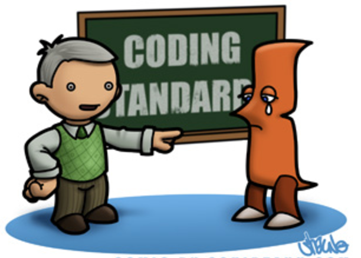

When you see the words “coding standard”, what do you think this is about? In my opinion, coding standards are very important
for a programmer. Coding standards are rules you must follow to make your code look nice and organize. It just like writing 
essay, you must follow some rules. For example, you must have space in front of your new paragraph, or you must put period 
mark when you finish a sentence, etc. Also, it’s a good habit to follow the coding standards, because if you write a program 
without coding standards such as no space indent. After few years,  if you look at you code again, maybe you will get so 
confuse and don’t know what did you write. 

Here is an example:
```
public static void main(String args[] ) {
	for( int i = 0; I < 10; i++) {
		System.out.println(“The value of i is: “ +i );
	}
}

public static void main(String args[]){
for(int i=0; i<10; i++){
System.out.println(“The value of i is: “+i);
}
}
```
I can tell most of you like first example more than second example, because it looks neatly and easy to read.


Lint is a tool that flags the suspicious and non-portable constructs, and every computer language there is a lint tool. 
For my ICS314 class, we use ESLint because we are learning JavaScript and this ESLint is a pluggable utility for JavaScript. 
After first week of using ESLint with Intellij, my impression is that I will use this to improve quality of my code. Because
I find out that my code look so messy compare to the code after I use ESLint. The process of getting green checkmark is 
painful but it also useful, because the most effective way to learn thing is learn from your mistake. ESLint help us to 
find out the coding standard errors , then after we fix those errors. Everything look perfect and we get a green checkmark. 
I am very enjoy doing this, even though its painful.

