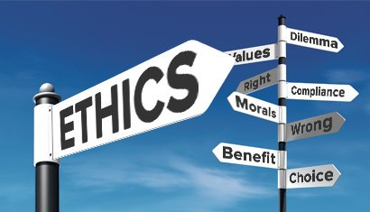

## whats the meanning of Ethics
  I cannot believe this semester is ending. In this semester, I have learned many different aspects of coding 
skills such as HTML and JavaScript. I can make very fancy website and web app now. I also working my final project with 
my teammates using Meteor, our project is a gym scheduler to help user keep track of the amount of weights they use for each
machine. However, as a software engineering, we code a lot every single day. I had a question very long time ago. Are ethics
ever-present in our code?

  
   The answer is yes. Ethics are ever-present in our code. Why? Since the advance of internet, programmer become very important 
in nowadays. Account to “The code I’m still ashamed of” by Bill Sourour, “if you write code for a living, there’s a chance 
that at some point in your career, someone will ask you to code something a little deceitful.” That’s true, most of programmer
can hack someone’s computer or do something harm to other and this is unethical. So, you should think twice about the effects 
of your code before write it. In my opinion, the meaning of ethics for software engineering is not harm to others, because 
programmer can harm someone such as hack someone’s account or something else. You should not blindly follow the instruction. Also, respect the privacy of others is one of the ethics for software engineering, because you may see the personal information that whoever using your app or program, and you should respect privacy of others. Should not exchange or
disclose someone’s information.
## Bill's situation
  The situation I chose to analyze is “The code I’m still ashamed of”, this article explores implications of blindly following 
customer requirements. This situation is about a programmer blindly following customer requirements to build a website to 
promote drugs for teenage girls. And they don’t care allergic, then end up with someone killed herself because the effects of
that drug was severe depression and suicidal thoughts. I think someone in bill’s position has an ethics obligation to act 
differently, because they build the website for drug, it's not for candy. It should think about every aspect of the drug before they promo to other. If I’m bill, I will think twice before I write the code and tell the customer about the allergic of drug.
## Conclusion
  In conclusion, the most important for us is to make sure that our ethics are present in our code, and should just blindly
follow what customer’s instruction.
