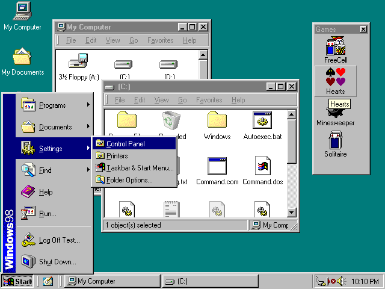
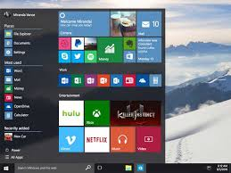
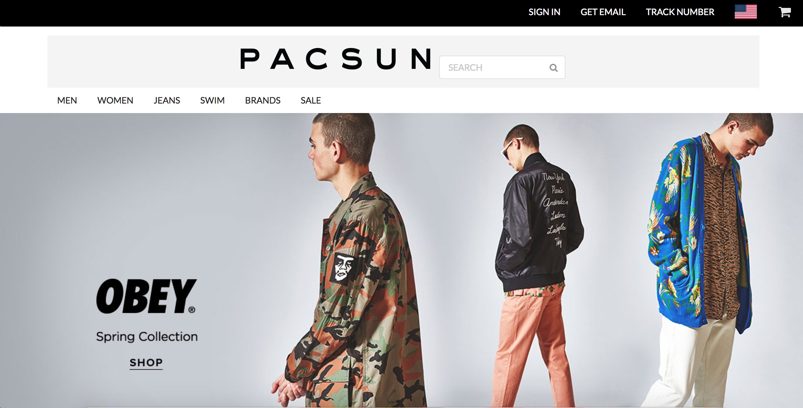

# what is UI Framework?
UI framework is a software tool for building software program to run on web. However, I have never heard or learn UI framework 
before. When I first see the screencast in my ICS 314 course about introduction to UI framework, I feel like this week going 
to be very heavy. Since I am a beginner of creating website, and totally no experience about HTML and CSS. After I learned UI 
framework, the impression is still very complicated and investment of time and frustration, but I strongly recommend people to 
learn this skill, especially for web developer. 

For these pictures above, which one you like the most? I think most of you will pick the second one. The first picture is the 
user interface menu for window 98, this picture is just like building a website using raw html and CSS. The color is very 
monotonous, border and box-shadow look so weird. For the second picture, this is a user interface menu for window 10, which 
is the latest version of window. This picture very colorful and make me feel comfortable. For now, this is different between
building a website using raw html and building a website using UI framework.

## Amazing website 
  after I learned UI framework, I had a homework to rebuild a website like the home page for island snow using Semantic
  UI. This was a very good practice, and this make me be obsessed with create website. I didn’t find Semantic UI difficult to
  learn, it just needs couple more hours focus on it, because you are not expert, and you always need to spend more times to
  learn something is new. However, this is a screenshot for my website I made using Semantic UI.
  
