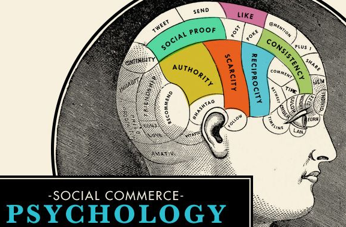

  

  
## Insanity

  "The definition of insanity is doing the same thing over and over again and expecting a different result." A famous quote widely used and stood its ground for years that many people claim originated from Albert Einstein. I often need to remind myself of this quote whenever I’m trying to solve a problem and especially when I’m writing code for an assignment. It's easy to get stuck in a loop and caught up in a specific pathway to your solution even though it's probably best to take a step back and re-analyze what you're trying to do. A couple days ago, I got stuck on a programming assignment I had to do for class. For hours and hours I tried to implement a search bar from react into my assignment and I ended up digging myself into a deeper hole, focusing on the wrong details of my work, complicating the assignment with additional problems to solve with adding unnecessary variables, functions, passing around data like a game of hot potato. Finally, I took a step back, went to sleep and sure enough that morning I reverted to my original problem and solved it with 1 simple step. I was pulling from the wrong collection. But that's the problem when trying to code. When there's so many ways to solve your problem. Some may be filled with more problems or there may be one simple solution. However, that is also the BEAUTY of coding! There are SO MANY POSSIBILITIES of designing an application! So many that we developers need a system to simplify the problem. That system is called "Design Patterns"
  

## Personalized Recipe
   

  

  Design patterns are the basis of code, programs, software, hardware, LIFE. A set pathway we implement into our daily lives to solving the challenges we face. Cooking, we all follow some recipe when first trying to recreate a dish. A dish that has proven to be delicious and optimized to fit our taste buds. A set of guidelines we implement into our dishes to create something of our own. These recipes are the design patterns of programming. However, these design patterns are in no means an "easy way out" when solving your problems. You also need to understand what you're doing and why you're doing it. I came across another problem yesterday when implementing a collection into my programming assignment. We already had a recipe (AKA: design pattern) to follow but it wasn't spicing up my programming like I wanted it to. The problem I solved involved the use of critical thinking, understanding the design pattern, and like cooking, a whole lot of patience. After hours of brute force of making unnecessary changes, I took a step back and realized I really needed to understand how data was being passed through different functions, files, and why variables were named a certain way. After understanding the template, I simplified the problem and asked myself, what am I trying to do? Finally, I focused in on solving the problem at hand and found a solution. I turned some template of code into my own personalized recipe.

## Psychology of Design Patterns.

  

  I also found an interesting article on the [Psychology in Design Patterns](https://tubikstudio.com/psychology-in-design-principles-helping-to-understand-users/) that not describes the code us developers use to implement our own ideas but to understand the pattern recognition that us humans have that draws us into their application. Us humans generally tend to draw ourselves to a familiar and nostalgic setting. Look at chunks of words grouped by similar ideas to give us a better visual on the websites we look at. Placing main ideas or links we would want the users to look at in the most obvious areas. We humans in ourselves are a design pattern and if we take the time to analyze the general popularity of users, were able to create a succeeding website that everyone can understand and is easy and fun to use.

[here](https://sourcemaking.com/design_patterns) are some tips on designing your own design pattern in Computer Science.
