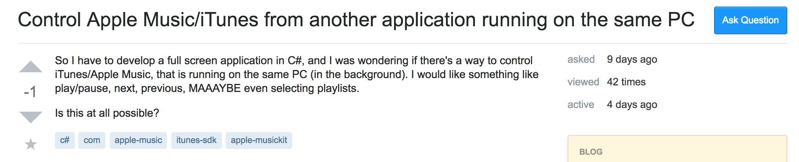
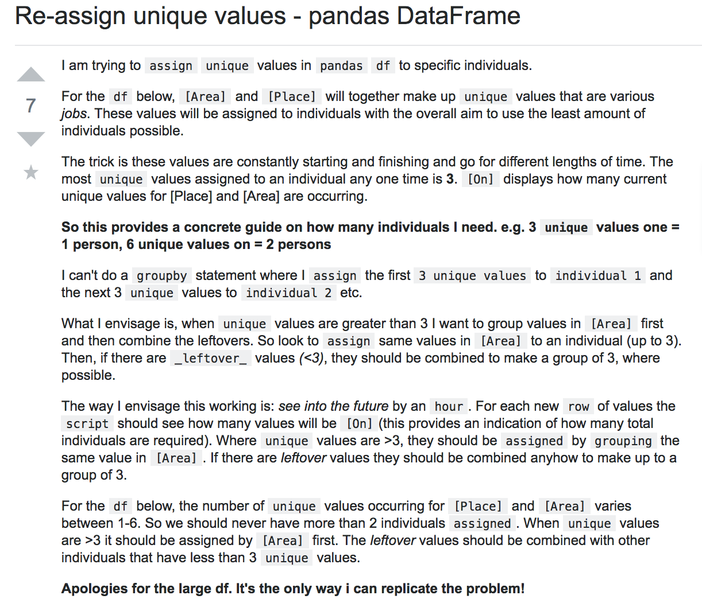

This week I started to learn about open source software, which is a great tool to collaborate and help with others throughout the world. The best way to receive help is to ask smart questions. I was able to read an article called “How to Ask Questions the Smart Way” by Eric Steven Raymond. The article had important information that could help others ask smart questions, but I did not appreciate the author’s writing style. The useful information in the article was clouded by the unnecessary rudeness from Raymond. It was very off-putting to me, and if it were not for me having to read the article for school, I would not have finished reading it. If Raymond wrote in a more positive style, I believe more people would appreciate the topic he was talking about, and implement it when they ask questions. Regardless of his writing style, I will be going over an example of what I think is a smart question and what is not a smart question, based on Raymond’s article.

## Bad Question

[Link to Question:](https://stackoverflow.com/questions/54204491/control-apple-music-itunes-from-another-application-running-on-the-same-pc)

This is the first question I would like to analyze. This question comes from Stack Overflow, and the first thing I noticed was the poorly written title. Raymond suggest that titles should be 50 or less characters, and this example does not meet that criteria (has 64 without spaces). The next thing wrong about this question, is that you can tell that the person asking the question did not do much work to look into the subject himself. Raymond heavily states that before asking a question, the person should do a lot of research on their own. If the asker did their own research first, they might not have had to ask the question in the first place, or may have asked a better in-depth question. In the end, the asker of this "Bad Question" did receive a useful answer from another user.

## Smart Question

[Link to Question:](https://stackoverflow.com/questions/54101445/re-assign-unique-values-pandas-dataframe)

This question is what Raymond would define a "smart question". First off, the title is concise yet informative. It lets users know what the question is going to be about, without "babbling on". You can tell from reading this question, that the asker has a good base knowledge about the topic, and that they have tried to solve the question on their own. The question is also grammatically correct and formatted in a way that it is easy for readers to understand. A great answer ended up being posted, where the person answering went into detail about what exactly was wrong with the code, how to fix it, and test cases to prove the solution true. This is a great way to answer, since the asker and other users learn more about the topic, instead of just how to fix this one exact case. The person answering the question also gains credibility when they post test cases.

## Which Question Was Answered Better?

I think that the smart question had the better response of the two. The first question received a response, but it was just a link to a user's repository. I believe that if the question was a "smart question, then there would be a more in-depth response that further explores the topic, where users can learn together. The second question received a very thoughtful, in-depth response that teaches the asker about the topic, instead of just linking to a user's repository that has a working example. This is a very small sample size of questions, but I believe if you ask smart questions, then you will receive a smart response.
