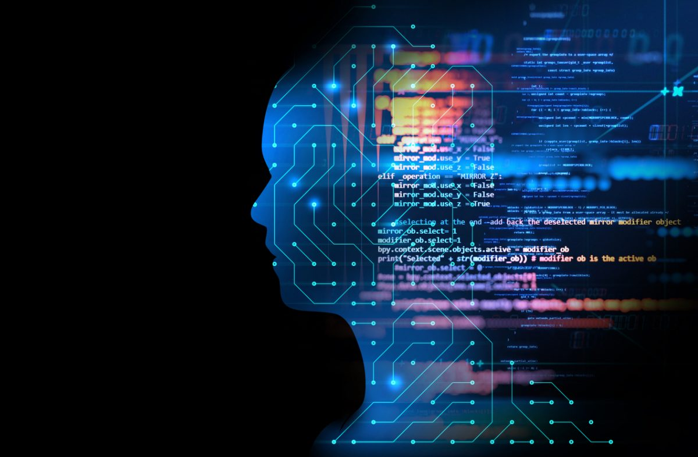

## Learning through trials and tribulations

I've recently completed a course in software engineering, and it was no joke.  We learned a new topic nearly every week, then were given a pass/fail timed challenge to accomplish. From learning Javascript, HTML, and CSS all the way to using Meteor and agile project management in Github to develop a complex final project, it was quite a journey.  The various tasks we undertook in our project required me not only to refresh my memory on topics learned months ago, but to scour the internet to learn many new things as well.  While the experience is fresh in my mind, let me share with you what I've learned along the way.

## Work smarter, not harder

Working on team projects can be very tough, especially in college.  There can be so many pieces of the puzzle to share, and keeping track of who is doing what and whether everything is done can be tough.  In addition, there's always the fear that one of your team members isn't doing his part.  Luckily, we learned to apply agile project management to tackle our project.  This concept we utilized in Github allowed us to split our lofty goals into manageable tasks, and assign each person one at a time.  We could easily check online what needed to be done, and keep track of who has done what and how much is left.  As hard as the project was, I wouldn't want to have gone without it.  Even though it is intended for programmers, I plan on using it for group projects in the future.  My girlfriend even wants to use it to keep track of the employees she manages.  It's refreshing when learning one subject leads to realizations and opportunities in other aspects of life as well.

## Remember humanity exists outside the computer

Software and hardware together can accomplish amazing things.  From trips to the moon to drones bombing huts in a desert and everything in between, software makes the impossible possible.  At some point one might wonder...can programming go to far?  It's one thing to be a soldier caught in a shootout in Afghanistan struggling to differentiate friend from foe.  It's another thing to program the drone to maximize casualties in areas populated by innocents.  The code we write may do things that can have negative consequences for others.  For example, a major consideration as self-driving cars are developed is the following: should cars be programmed to minimize casualties?  If the car was headed for a group of people, should it veer into a single child?  Or if the choice was between a group of kids and the driver, who should die?  Mercedes has recently answered: of course the driver is the priority, anyone not driving a Mercedes is expendable.  From the CEO all the way down the chain to the programmers, the call was made and carried out.  While other car manufacturers make up their minds, Mercedes set a precedent for coding that I fear the consequences of.  At what point are machines programmed to kill humans rather than be damaged?  We must all be mindful of our ethics, our values and priorities, and draw a line in the sand for ourselves.  I don't think any job is worth that amount of staying up at night.

## Code.  Test.  Repeat.

Growing up as a child, I always enjoyed puzzles.  Brain teasers, mysteries, and riddles kept me interested and stimulated.  My parents were convinced that everything important was already known and all I needed to know was in encyclopedias or the Bible.  Yet I kept my sense of wonder, and aspired to be the type of person to make a change one day.  This led to me doing puzzles throughout my life...and all that couldn't prepare me for the doldrums that is code testing.  Although I shouldn't be too hard on myself for struggling through coding languages and programs I had only peripherally learned, the strain of debugging code made me question my drive and aptitude for puzzle-solving.  So many times I was sure the code would work, but the program would crash.  There were also a handful of times where changes to the master branch inexplicably vanished, and I had to piece together what was missing.  The worst of it was when I spent over six hours trying to fix an error...that no one else turned out to be experiencing.  I discovered on StackOverflow that perhaps one of the code packages being up to date caused the program to crash.  Indeed, downgrading it solved the problem.  To me, this is a bit like a building falling over because the laws of physics changed.  This has got me to thinking of the experience as more like operating in Hyperspace, or like the TRON movies.  In the world of programs, we users have to abide by their rules.  What we know we know may not apply to the 1's and 0's flicker in the system.  This is no walk in the park where everything makes sense like architecture--THIS IS SOFTWARE ENGINEERING!  In the end, I learned something new to consider when troubleshooting, and it only took 6 hours of my finals week.  From now on I'm trying to keep an open mind and think outside the box--the more I think I know what I'm doing, the more likely it is I'm making a mistake. After all, as a wise man once said,

<blockquote>
"
One thing only I know, and that is that I know nothing.
"
   
<footer>
-Socrates
</footer>
</blockquote>
