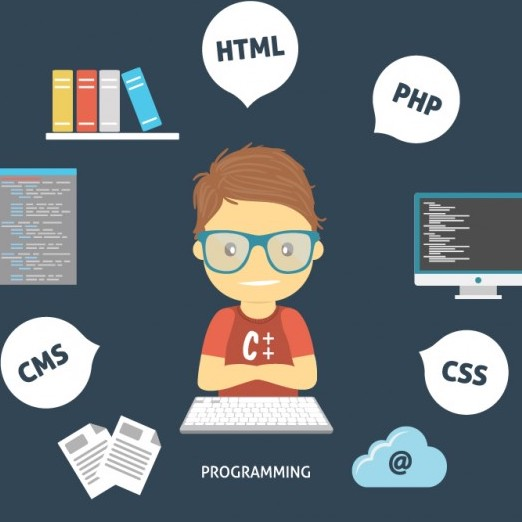

What is the software engineering? software enginnering and computer programmer both develop software application needed by
working computers. The difference between these two positions is software engineers use well-defined scientific principles
and procedures to deliver an efficient.

when I was senior in high school, I wanted to major in accounting, because I think math is easy for me. However, I changed 
my mind after I talked with my dad. He told me to pick a something that I like, not something is easy for me. I was always 
fascinated with computers, so I decided to be a ICS student. after I took ICS111, I realized this is what I want to do for
my future. For ICS111, we need to use EZ graphics to create our own game. even though, I was not a programmer expert at that
time, but I enjoyed it.

my plan for the future is to develop my programming skills to become a profession programmer, and I want to create some games
like League of legends. also, I want to learn more programming languages as much as I can. because a good programmer should
able to understand code for different language.
