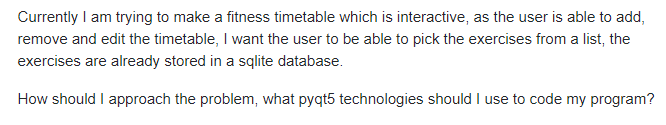
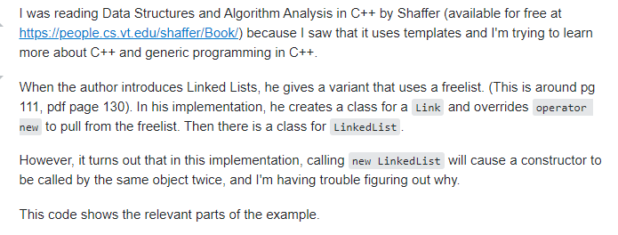
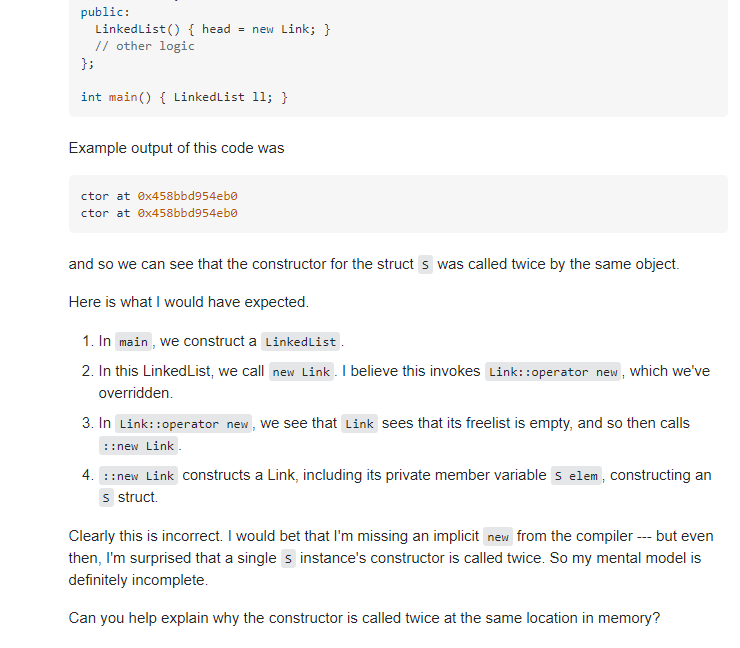

It is erroneous to assume today’s programming elders mastered their technical fields without encountering roadblocks in their educational journey. No one is born with technical expertise; it must be learned over time. Thankfully many these roadblocks have already been overcome by others, and with the genesis of open source software and communication forums like Stack Overflow, the answer to ones roadblock is likely just a few clicks away.

However, It is also erroneous to assume that a user will not experience hurdles their first few times seeking technical assistance, whether it be on a forum like StackOverflow,  a group messaging app like Discord, or even on a customer support helpline. With this ease of communication, it is not uncommon to see unspecific, uninformative, ungrammatical, and even unprofessional questions raised in these forums. An example would be the following post on stack overflow that asks [How should I approach the problem of making a fitness timetable?]( https://stackoverflow.com/questions/65865127/how-should-i-approach-the-problem-of-making-a-fitness-timetable). According to Eric Raymond’s “How To Ask Questions The Smart Way”, this question is unspecific and unexplicit, as defined below. The asker then follows with this description: 

Although this provides the reader with a little more clarity on main issue at hand, it also introduces many other open ended questions like “What is a fitness timetable?”, “Edit the timetable how?”, “What will the table be used for?”, and “what have you done so far?”. Lastly, although there is no code written in this question, it is a good example of Raymond’s notion of “volume is not precision”. Had the user asked only one question and focused more on one specific aspect of the project, he may have seen better results. It’s no surprise that even though the question was only asked 25 minutes ago, the question has already been downvoted 3 times and is now closed. 

On the other hand, a smart question will usually receive a correct and timely solution if asked in the appropriate forum. For example, the following question “[Why is this C++ constructor called twice at the same memory location in this implementation of a linked list?](https://stackoverflow.com/questions/65853907/why-is-this-c-constructor-called-twice-at-the-same-memory-location-in-this-imp)” not only asks for an answer to one specific problem, but also mentions the fact that the constructor is in the implementation of a linked list.  He follows up the question by providing a link and page number to the learning material where he is encountering the problem and code to be referenced by the reader. 

He then adds more specific detail by providing the actual output of the code, and his expectation of what the code should output. 

As seen above, he then wraps up the post by stating his question again, ensuring the reader has not diverged from the original question at hand. In addition to being precise, this user has also shown that he has put effort into finding the solution to his problem by researching it on his own and providing those helping him with an in-depth explanation about the problem. Lastly, the question is free from politics and the user is able to express that he is probably at fault instead of the author of the text he is referencing. It is likely due to these reasons that this question has already received 7 upvotes and 2 answers in less than 24 hours. 

Being an effective communicator on sites like StackOverflow not only help users solve their engineering problems, but also trains them to be great communicators in the technological and engineering sector, where problems can be very in-depth and complex, and asking for help is an essential part of the job. 
