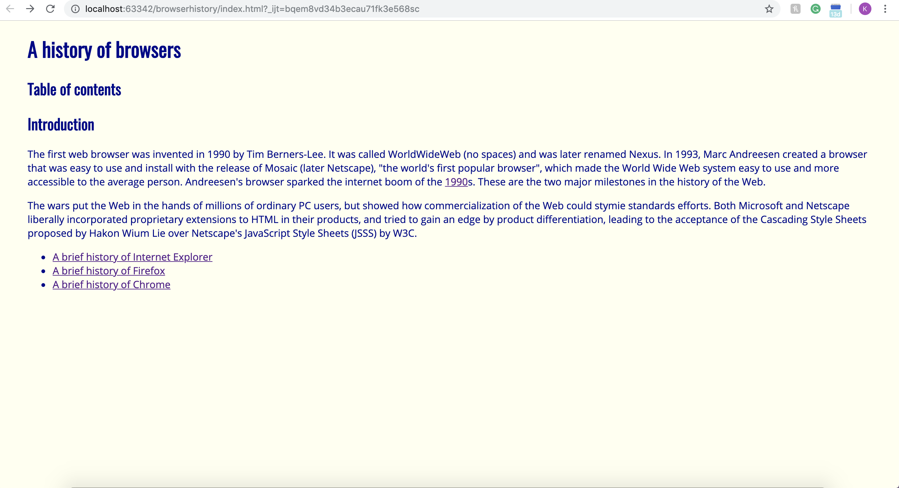

UI frameworks are hard. This week I was able to experience Semantic UI for the first time. I had no idea what I was doing. I constantly copied examples given to me, and struggled to make even the smallest changes to fit my needs. I ended up finishing this weeks WOD about five minutes before the DNF time. All that being said, the quality of the websites I produced has increased dramatically. You can see the major difference in my example pictures. 

 

The first picture is a website I made after a week of learning html and css. If I saw a website that resembled anything like that while browsing the internet, I would click off of it immediately. It looks like it was made is in 1990. The second picture was a week after the first picture, where I got to experience Semantic UI. This website looks like it could be a real website used by a very small start up company that can't afford a professional website. To an extent, It is visually pleasing and would not make me immediately click off of it. I am very proud of the product for only having a small intro to Semantic UI, and I can't imagine what my websites would look like after fully understanding this UI Framework. 

## What to strive for?

My biggest struggle right now when using Semantic UI is making the ideas in my head appear on screen. While using raw html and css, you are very limited to what you can do, but you know exactly what you type is what will show up. Semantic UI has many aspects to it, and you need to understand what all the different elements do in order to paint your picture. I have been doing a lot of trial and error, which is good to learn how different things affect your code, but I want to get to the point where I can think "I want a row of pictures evenly spaced out at this height" and I know exactly what I need to do to make it happen.

I look forward to spending more time learning Semantic UI. I believe it is a powerful tool that could potentially get me a job in the future, or even further develop my passion for ICS. Even though it can be frustrating to learn a UI Framework, it will definitely be worth the effort. Now its time to put the hours into practice.
