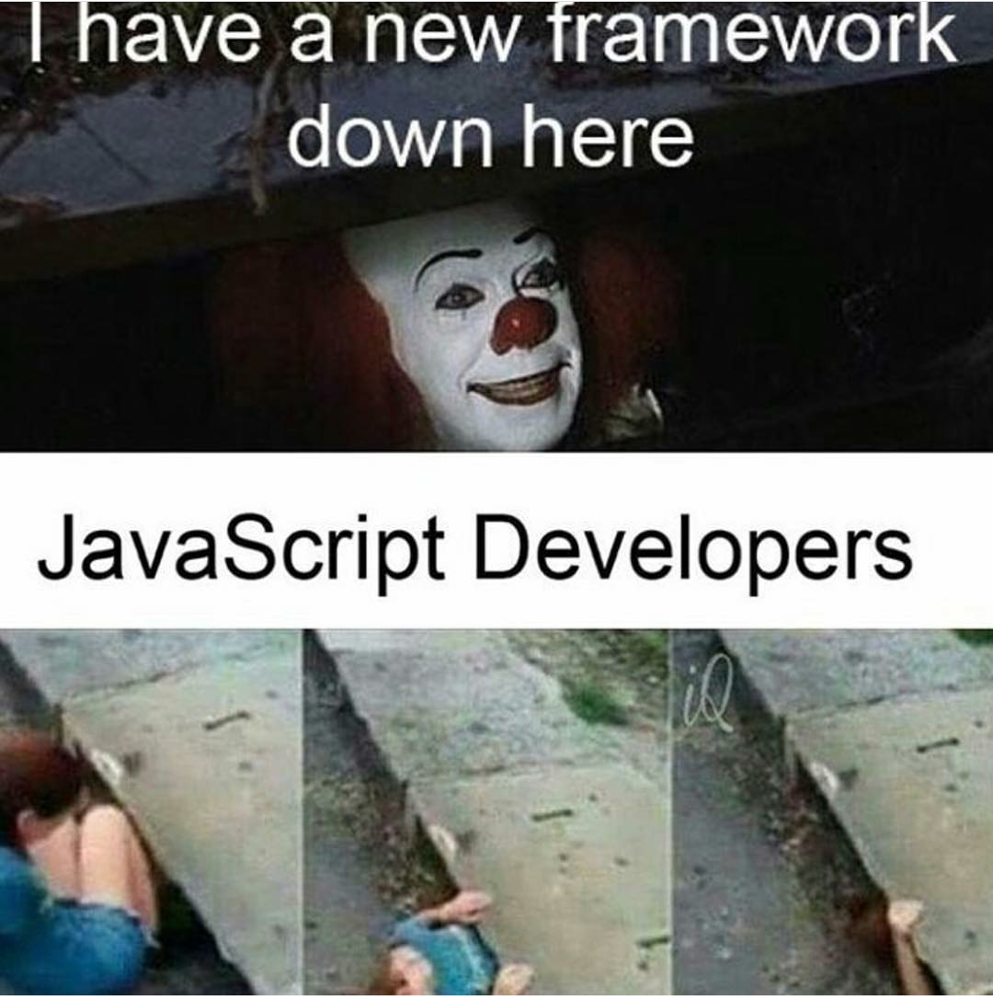

UI frameworks are hard. This week I was able to experience Semantic UI for the first time. I had no idea what I was doing. I constantly copied examples given to me, and struggled to make even the smallest changes to fit my needs. I ended up finishing this weeks WOD about five minutes before the DNF time. All that being said, the quality of the websites I produced has increased dramatically. You can see the major difference in my example pictures. 

<!-- 
  -->

The first picture is a website I made after a week of learning html and css. If I saw a website that resembled anything like that while browsing the internet, I would click off of it imediately. It looks like it was made is in 1990. The second picture was a week after the first picture, where I got to experience Semantic UI. This website looks like it could be a real website used by a very small start up company that can't afford a professional website. To an extent, It is visually pleasing and would not make me imediately click off of it. I am very proud of the product for only having a small intro to Semantic UI, and can't imagine what my websites would look like after fully understanding this UI Framework. 

UI Frameworks might have a steep learning curve, But once you understand a framework, the 
