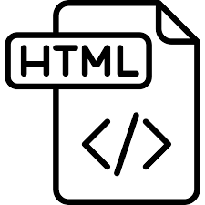

Recently did I get into learning about building a website, initially with raw HTML and CSS, and then eventually with Semantic UI. I found raw HTML to be sometimes nice where it gave me a good amount of control of how I would like things structured in a page. The tedious amount of work that comes with formatting things in a webpage does come out to be very annoying however. With Semantic UI, it became somewhat easier to create a good looking webpage with the included functionality that Semantic UI provides.

## Semantic UI and JavaScript
To me Semantic UI to HTML & CSS is comparable to me learning JavaScript after working a lot with the C language. Semantic feels like it gives good utility for the user to put together, similar to how JavaScript includes very useful functions for performing various tasks. Again I feel that this higher level of control Semantic UI gives has the same pros and cons JavaScript had when compared to C. It allows very a more fluid implementation of websites, parallel to how JavaScript gives a easier way to implement a given function. Whereas you may have less granularity in how every single element would be laid out and formatted, similar to C, where you have very fine control in memory allocation, etc.

## Conclusion
In the end having a higher level coding language always will have its place in whatever environment its in. Whether it be in a regular coding language or in building a website, it provides a different method for various levels of implementations. It allows for fast development and for maybe a more new user to have a more smooth experience in learning the language.
