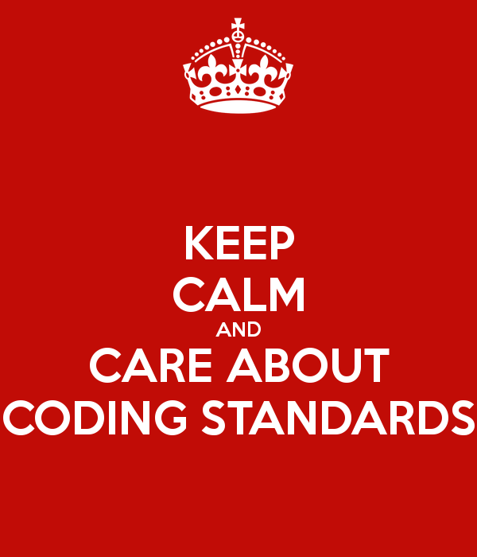

## Sorry, I Have Standards...

Coding standards are like guidelines for coding. Like a set of rules, they were created and used by many people for a reason. Ignore the hippies that tell you, "Rules are made to be broken." and pay attention to the drill sergeant that says "DROP AND GIVE ME 20 FOR PRODUCING THAT SORRY EXCUSE FOR A CODE." It only makes sense that everyone should follow proper coding standards. There are many programs that are created by groups of people, imagine a group with different standards of coding. Put together a couple people here producing sloppy code, a couple people there producing amazing organized code, and the one dude that codes like a baboon and what do we get? Chaos. If they all wrote a code that produces the same function, but their code is different from one another, it doesn't look good. Simply put, following proper coding standards saves time and allows everyone to work together more efficiently. There are only benefits to gain from good coding standards, so it would be smart to follow it. 

Looking back at all my Computer Science classes thus far, coding standards have always been promoted by professors. Sure, you may think, "Oh it should be fine to have a closed curly braces immediately after this semicolon," and the next thing you know you are mocked at interviews by job employers, disowned by your parents, and homeless... ok, that might be exaggerated, I'm sure your parents won't disown you, BUT professors do tell you to produce your code in an organized way for a good reason. I assume it is because they have many codes to look at and to be able to understand what you wrote at the drop of a hat is essential. Also, you will be learning many different coding languages as time goes on, but what remains the same would be coding standards. By following coding standards, when learning a new language, you may notice similarities in different languages and as a result absorb the language better.

## Exhibit A: Me.

When I took introductory courses to Java or C, I always questioned why professors wanted us to write our code a certain way. I considered it tedious and unimportant. Then the group project came. My God, it took me a good minute to figure out what other people's code did. I thought to myself, "If they had wrote this the way I write my code, I could've understood it in a millisecond," and thats when it hit me like a pile of bricks. Professors want us to code the same way, so we could understand other people's code faster because it would be like reading our own code. Now, as I'm using ESLint, I think it's a good idea that it takes notice of the user's bad coding standards. If you follow the proper coding standards, a green checkmark will be displayed in the top right corner. Even though it may seem very picky, it's drilling the same coding standards to everyone who uses ESLint. Promoting the same coding standards to people learning new languages, produces a population of coders that are "same same" and not different.
