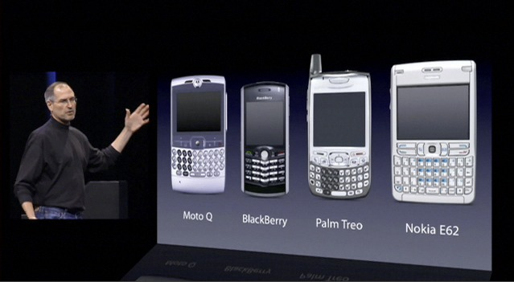

## Design Once

<blockquote>
I like to choose a lazy person to do a difficult job, because a lazy person will always finds an easy way to do it.
<footer>
Bill Gates
</footer>
</blockquote>
This is a famous quote from Bill Gates that I think would make most people laugh, but not many can truly understand what he means. Most people would think an easy way means whatever to get things done, even if with low quality result. However, as a lazy person myself, I think an easy way should be a way that can reduce the efforts to do the job, but the quality should be the same or even better. And that's why we need a design pattern, something you only need to create once, and reuse it over and over without starting from scratch every time.

 

  

  
  

  

VS

  

    
  

 

For example, let look at the iPhone, it's one of the most successful product that did not only changed Apple, which was a computer company, but also changed the whole mobile devices industry. And one thing that makes iPhone became such a success because of its design. There is only a single button on the iPhone screen, which is the Home button. So what if other apps require more buttons? Well, the developers can just create their own buttons for their owns app, which can be placed anywhere on the screen.  

I used the iPhone as an example for design pattern because it's something that most people can easily imagine. As you see, the iPhone screen is a design pattern. It was designed with only one button, so the developers can add their own buttons that are needed for the application. And not only buttons, the iPhone also came with multi-gesture features, so let say in an app like a browser, in most phone, the users need to press the arrow keys to go up and down, meanwhile in the iPhone, users only need to slide the screen with their fingers, and the buttons are not even needed.

And that's what design patterns are about, you create a foundation that can be reuse multiple times for multiple purposes without conflicting each other. Like the iPhone, different applications have different user-interface, every time the user switches between apps, they see only the user-interface that was designed for the app they are using.

## What Design Patterns Are There?

The iPhone is an example of a design pattern called MVC or Model-View-Controller in which implementing a user interface which can be customized and controlled by the internal code in which the users can't see. The benefits of MVC is that because it has different layers (user-interface, coding, and model), people with different skillset can work separately without interfering other's works. However, it's required a good amount of times to learn and understand.

There are also many different design patterns such as:
- [Factory](https://sourcemaking.com/design_patterns/factory_method/java/1):
  - In which create a basic structures that can be used or expanded to create multiple classes.
- [Singleton](https://sourcemaking.com/design_patterns/singleton/java/1):
  - Provide a "global" variable" in an object oriented language that does not support global variables.
- [Observer](https://sourcemaking.com/design_patterns/observer/java/1):
  - When a set of objects need to be informed whenever a change in state occur to another subject.
- [AntiPatterns](https://sourcemaking.com/antipatterns):
  - In which, in contrast with design patterns that are commonly occur when you write code without thinking about the consequences and how it's going to reuse with different situation.

As a senior computer science student, I have experienced all the design patterns (including AntiPatterns, well mostly AntiPatterns in which I'm not proud of). However, the more I practice coding, the more I understand how important a good design pattern is. A well designed pattern may take sometimes to build, but when it comes to development, it pays up fast with all the time it can save. Reusing design patterns helps to prevent subtle issues that can cause major problems and improves code readability for coders and architects familiar with the patterns.
