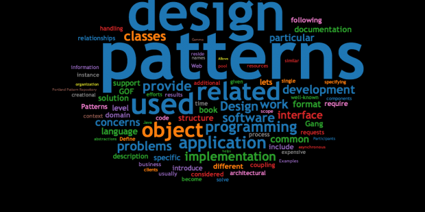

<h3>There's So Many!</h3>
When it comes to design patterns, they've always felt confusing but so famaliar at the same time. They were the foundations of my coding and the coding of my peers, but reading through all of them feels so foreign. Granted I haven't even come close to using every single design pattern, or even seeing them implemented. As a refresher, what even is a design pattern? Design patterns are basically strategies for solving programming problems. They provide an entire structure and methodology for creating solutions. Some common examples include "Abstract Factory", "Builder", and "Composite" patterns. These are essentially systems of classes, class instantiations, and tree structures respectively. There are also some obscure patterns such as "Object Pool", and "Proxies". These strategies permeate through every program out there, showing itself in all sorts of software. These were just some examples, but don't even scratch the surface of how many diferent kinds there are, especially when we consider that each one has subcategories to focus on different applications. Design patterns are immensely important to know, not only to help the individual programmer solve problems, but more so, to help a team of programmers communicate by providing a language of problem solving strategies. It allows programmers to be on the same page and to tackle problems more efficiently.

<h3>How Useful Are They?</h3>
Using classes is most likely the easiest design pattern to understand. At least it was for me. When first learning how to program at UH Manoa, we learned with Java. Everything in that language was a class. And every problem or assignment thrown at us, we had to solve with classes. But design patterns don’t only constitute large, conceptual groups. They also deal with smaller, more specific applications. For example, we have “Commands”, “Iterators”, “Null Objects”, and “States”. Each of these are common expressions in the programming world, and don’t need an explanation from how prevalent they are. We use these all the time, and every language is likely to have some way of expressing them. They’re useful to think about, and are likely in every piece of code I’ve written. But just because they come naturally, doesn’t mean we shouldn’t talk about them. When dealing with larger projects, applications, and software, programmers will need more robust methods and design patterns to handle complicated and intricate actions. Likely a whole team will be dedicated to this project. And with more people, the harder communication becomes. That’s why, with my experience in design patterns, working on homework assignments or projects with classmates is made a lot easier. It provides groundwork for us to communicate effectively and contribute to each others ideas.

