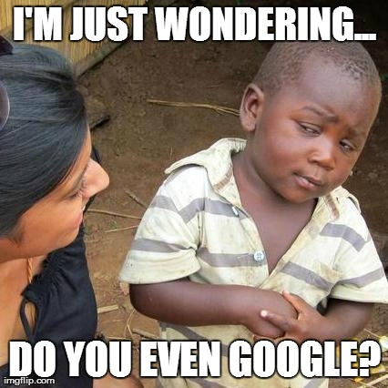

## Git Good

	

If you are a gamer like me, you would probably understand what I mean. If you are not, well, it means keep practicing until you become better. For this situation, it means to become better at asking a good question. A good question doesn't only get you answers, it may also be appreciated by other developers who also have the same question and the ones who answer it. 
## And How To Git Gud?
According to Raymond's essay [How To Ask Question The Smart Way](http://www.catb.org/esr/faqs/smart-questions.html), hackers like good and hard problems because it's more rewarding to answer one hard and unique question than a hundred basic questions. Sometimes, a good question reveals the problem that they might not noticed or didn't think of. 

> *"Among hackers, Good Question! is a strong and sincere compliment."*

Although a hard question is more favorable by hackers, however they are not limited to answer to only those questions. A good question can also be a problem that you are facing but couldn't solve it by yourself. However, before you ask question, you need to at least *google* it (Yes, I use Google as a verb, you can suck it up other search engines!) because someone may already asked the same question,    or there maybe other sources that may solve your problem.  According to Raymond, if you receive a reply that says [STFW](http://www.catb.org/esr/faqs/smart-questions.html#rtfm), you probably didn't try to look it up, or didn't try hard enough.  If you already tried to find the answer, but still struggling, you need to include that in your question.
Because that could at least let them know, you already tried, and that your question may help other people who also have the same struggle. For example:

> *"I already googled this issue, but I couldn't find anything useful..."*

## What You Should Avoid When Asking A Question

According to the Author of *How To Ask Question The Smart Way*, there are things that you should avoid when asking a question:

1.	Avoid to TYPE IN ALL CAPS
	- Most of us know, when you see all cap, people see it as yelling, and it's considered rude because who would want to help when you keep yelling, especially when they do it for free.
2. Be clear and specific about your problem
	- If you want to get a satisfactory and helpful answer, you need to make it clear what is the problem you are facing and what you have done so far. Because if you don't, people who want to help wouldn't be able to help without enough information. They may ask you to try the same thing that you already did, and then you have to explain you have done that...In the end, you are not only wasting your time, but also other's time.
3. Don't make assumptions unless you have enough evidences to back it up
	

	
	

First of all, assumptions without evidences would make you sound stupid and arrogance. 	
 
Second of all, it would not be as accurate as when you describe the real symptoms. If you are asking question, then you should only talk about the issue that you are facing, let's the pros identify and diagnosis because they are better at that than you. It's like when you go to a doctor and tell them what disease you're having. Well, then why do you have to see a doctor? See what I'm saying?
4.	Use correct grammar
	- The way you describe your problem could also describe how you write your code. If you write a sloppy and careless question, the hackers could assume that your code is sloppy and careless as well. And that's not their problem, it's yours. So make sure that you checked your grammar before submit your question.
	- It's always better to use English, because it's the most universal language that most people can understand. However, if you are not good at English, you should explain so to alert the readers, and they may let you get away with some basic mistakes. Also, they may try to answer in a way that you can understand at your English's level.

## Example of Good And Bad Questions
Here are two questions that I found on StackOverflow, could you tell which one is a good question and a bad question without open the link?
	
1. [regex_replace matches end of string twice](https://stackoverflow.com/questions/46109594/regex-replace-matches-end-of-string-twice)
	
2. [Program giving different output every time I run code](https://stackoverflow.com/questions/46109027/program-giving-different-output-every-time-i-run-code)

If you pick the first one, then you are right. They are both very short questions, however the first one can tell the hackers what problem he/she is facing. On the other hand, the second question doesn't give a clue about what's happening until you read the description. This demonstrate that the one who asked this question may have no clue what he/she is doing wrong.

## In Conclusion
Asking a good question may not only get you good answers, but also establish a good source for other people who is having the same problem.
If you want to know more, you can go to [How To Ask Question The Smart Way](http://www.catb.org/esr/faqs/smart-questions.html) to have a better understanding.

 
