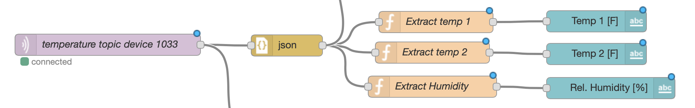

## How I got into Coding
I was first exposed to "coding" about 10 years ago on my first job at Kapiolani CC as a freshman in the pre-engineering program. I was given an Arduino Uno and told to go through tutorials until I was comfortable enough with it to start contributing to an undergraduate research project that required some sensor data collection and display.

This type of project-based and on-the-job learning has been a common theme in my exposure to various programming languages since then: I learned Python for a few robotics-related projects (and coursework therafter), the Wordpress framework (HTML & CSS) for a STEM education project ([STEMD2](https://stemd2.org)), Matlab for engineering-related coursework, Elixir ([Phoenix framework](https://www.phoenixframework.org/)) for developing a conference management system ([HICSS](https://hicss.hawaii.edu)), Javascript ([Node-RED](https://nodered.org)) for IoT projects, and Typescript for other web development projects.

As an engineering major, I wasn't exposed to a formalized software engineering curriculum during my studies. Instead, I was simply curious how various languages/frameworks could help me solve the problem at hand. I've found this way of learning quite enjoyable and am looking forward to finding a fun project for this semester. In addition, I'm especially looking forward to a more formalized learning environment to get a more in-depth exposure software engineering principles.

## Preference for Functional Programming Languages

One of my favorite classes in the mechanical engineering undergraduate program were the study of dynamical systems and the control thereof. One modeling approach employed by engineers is the representation of systems with block diagrams and transfer functions as this representation describes the relationship between the input and the output of a dynamical system. (The same idea also applies to modelling electrical circuits.) How does this related to Javscript and program? I believe it's influenced my mental model of and affitinity towards working with languages that support a functional programming paradigm. 

For instance, I first started "using" Javascript to prototype distributed sensor and control systems (IoT systems) with [Node-RED](https://nodered.org). Node-RED flows remind me of the aforementioned block diagram modeling approach because they consist of Node-RED nodes, i.e. snippets of JS code, that can be wired together with their respective inputs and outputs. This makes Node-RED a great toolkit for rapid prototyping of IoT systems. Within hours, one can put together a little prototype consisting of just a couple Node-RED flows, one on a Raspberry Pi (RPi), and one on a remote webserver (or personal machine). The RPi flow may read in some sensor data and publish it as a JSON-formatted payload using the MQTT protocol. The webserver flow can then consume the message, process it, and write it to a database or display it in a data dashboard. 

 *Sample flow snippet showing how incoming data can be piped and processed by various function nodes before being displayed in a UI.*

From this experience, I learned to appreciate the simplicity of working with JSON objects in Javascript and the utility of processing data/requests with simple input-output functions. I find the visual representation of nodes with arrows going into the node as inputs and arrows leaving a node as outputs illustrate the idea of functional programming quite well for novice programmers. More advanced software engineers might find the visual approach too limiting. 

I have personally worked with Elixir and the Phoenix framework a bit as well and really enjoy breaking problems/programs into sets of reusable functions that take data, do stuff with it, and return an output that can be displayed or utilized in another function. For this reason, I find the [pipe operator `|>` in Elixir]() quite useful as well and hope it will pass the experimental stage in Javascript. Although I must admit that this opinion is solely formed based on my experience coding in Elixir and that I have not tried the experimental pipe operator in Javascript.

The more formal expression of "functions are first class" was new to me and I look forward to learning more of the technical software engineering concepts/jargon.

## Is it a Feature or a Bug?

While it's great benefit that npm is the fastest growing ecosystem, there are some "downsides" that arise. For once, given that there are often more than one package for a certain set of features, team members may have different preferences on certain packages, e.g. `lodash` vs. `_underscore`. This can at times create friction in the team when some members aren't happy to switch from what they're used to. Additionally, when one starts to depend on the maintenance of a package, one might get disappointed when that package is no longer supported, or when the author decides to add silly bugs to their packages as with the [recent incident in the faker.js library](https://www.theverge.com/2022/1/9/22874949/developer-corrupts-open-source-libraries-projects-affected). 

## Concluding thoughts on JS and the Athletic Software Engineering

Learning a programming language "on-the-job" comes with its disadvantages, namely that one tends to gloss over technical details or that one only goes as far as the project/job requires. For example, while I've used the `pop()` and `push()` methods, I hadn't used the `shift()` and `unshift()` methods. Going through the tutorials was thus helpful in that regard.

I expect that the WODs will also be a good challenge as there's always more than one way to solve a WOD. While one could just try to "get it done", one could also use it as an opportunity to come up with different ways of solving them and finding the most "readable" or most "concise" solution. That said, having many small tasks rather than a few big projects will be challenging from a time management perspective. 
