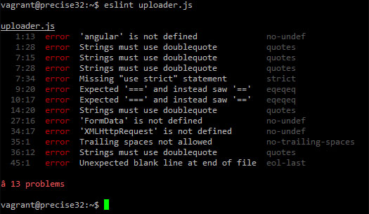

<h3>What I thought Coding Standards meant</h3>
  Learning to program, I’ve always heard the term “coding standard” get thrown around. However I never really got around to really learning the importance of it. I just thought it was something that big companies needed so that multiple developers could pass code easily. Recently though, learning programming in a formal setting, I realize that it’s more important, and that it’s getting stressed a lot more. I’ve always thought that as long as the code is easily readable and consistent, coding standards was more of a recommendation than a requirement. And even now, with learning how to work with a Lint program in IntelliJ, I still feel that this is the case.
<h3>Using ESLint on IntelliJ</h3>
  I recently downloaded and started using the popular IDE IntelliJ. It was required by my current Computer Science course at UH Manoa and it’s honestly quite useful. It allows you to actively find bugs in your code as you write, and run the code right in the IDE. I know that these features are not unique to IntelliJ, and that there’s probably a ton more features available, but I want to focus on the ESLint program that I was also required to use and adhere by. 
<h3>How ESLint Works</h3>
  ESLint is the program that constantly checks your code as you write for errors and general good-practice tips. For example, when writing a function in Javascript, it will throw a warning if I don’t write a space between my function name and the first open parenthesis. And until I fix it, the warning will remain there on the right side of my screen. The reason why I bring this up is because every time I get a warning, I wonder if this is really worth fixing. “Is a space really that important?”. I only fix it because it’s required by my course, but if I was developing something for a job or for myself, most of the issues I probably wouldn’t bother to fix. And if I’m being honest, some of them don’t even seem useful either. As of now, my current experience with ESLint is just an extra chore I have to deal with to get full points, not something I appreciate.
<h3>My Current Stance on ESLint</h3>
  My stance on ESLint is probably biased though in that I just started using it. It’s catching all the “errors” in my coding habits, and so all the corrections seem unnecessary since I know my habits aren’t errors. But I’m sure as I start to use ESLint more, I will notice the errors before the program does, and it’ll help me write better and cleaner code. Right now however, all it’s doing is making my timed exercises slower and throwing me for a goose-chase trying to track down all the errors. 
