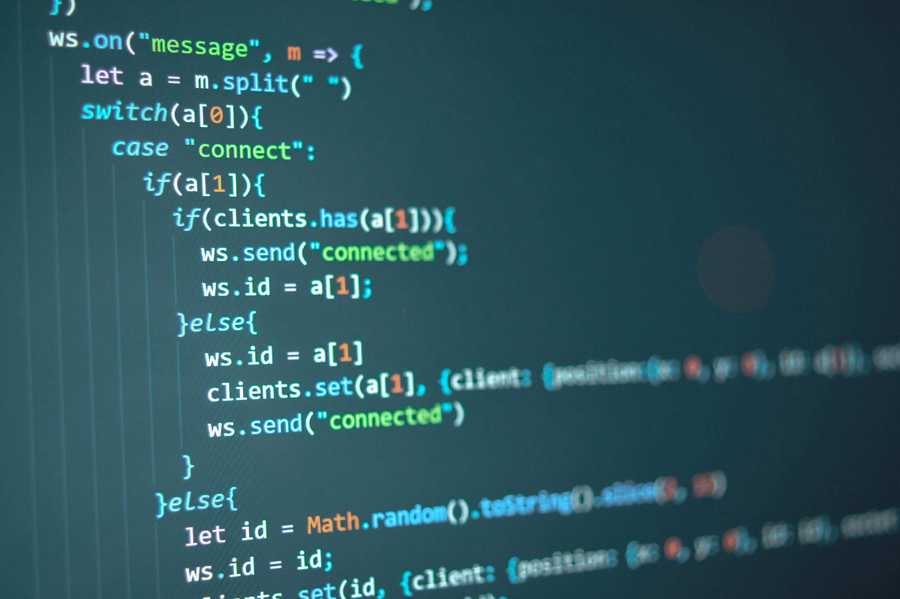

Javascript is neat little language. It's not quite as tight or secure with its typing of variables like Java is nor does it support multi-inheritence like Java does. But from the very little experience I already have with Java, I'm enjoying Javascript a lot in much less time! Javascript is not without it's down sides but that isn't to say it's a terrible language. On the contrary, Javascript is an incredible language. It's very easy to understand and learn, making it very easy for experienced coders to pick up and go from the start, yet also allowing beginners - such as myself - to easily learn the language because of its simplicity and ease of access.

## Javascript is Easy

Javascript is one of the easiest prgoramming languages to pick up. I believe this is one of the main reasons as to why most web pages tend to have responsive buttons, pop ups, alert boxes, etc that were all probably coded in Javascript. It doesn't have a huge set of rules to follow. In addition, because of its popularity among web developers, there are a multitude of videos that help teach beginners about the language. It's very flexible and accessible. You don't even need an environment to run it, you can find multiple sites that support Javascript and allow you to learn such as [jsfiddle.net](https://jsfiddle.net/), or even just use [Chrome Dev Tools](https://developers.google.com/web/tools/chrome-devtools). All you need is a good laptop, an internet connection and some spirit!

## Javascript is Old

Yes Javascript is super easy and accessible, but it's also been around for 26 years. Javascript's accessibility has been one of its main draws but over the years its grown into the behemoth it is today! The language may have grown and made adjustments but there are still many oddities possible with the language such as NaN not being NaN. However, it's also the case that many of the ways to possibly code in Javascript that leave people dazed and confused have explanations as to why they were designed as such. In addition, the seemingly massive language that Javascript has become isn't so daunting when you realize that [Javascript has excellent documentation](https://developer.mozilla.org/en-US/docs/Web/JavaScript). So yes, Javascript is old but it has aged like wine.

## Javascript in the Modern Day

For much of its lifespan, Javascript has faced much scrutiny. Whether it be for its simplicity leading to potential security issues, or that its age is finally bringing it down, this will always be the case until the day Javascript dies. But that day doesn't look to be anytime soon. [Javascript still one of the most popular languages](https://developer.mozilla.org/en-US/docs/Web/JavaScript). Not to mention its prevalence in pretty much every web page and its support on most browsers, Javascript has a lot left in the gas tank. I believe that although Javascript may be a heavily scrutinized language, there is no language without its faults.
