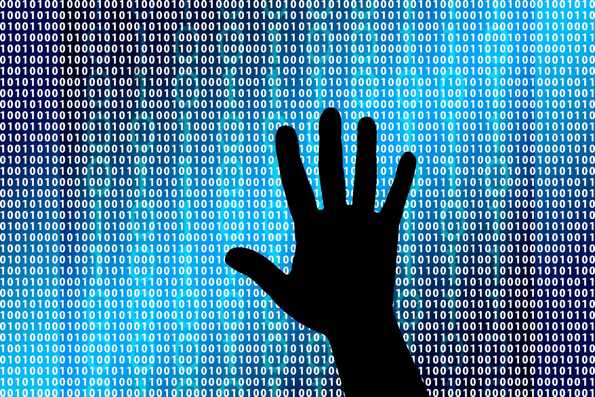

When I was in high school, I had no idea what I wanted to do with my life. I was always envious of people who had set out goals for themselves giving them the drive and desire to achieve them. My chosen major was not a lifelong dream or anything, I just felt like I had to make a choice and computer engineering was something that best fit my interests. I chose Computer Engineering because I was always interested in electronics. When getting a new device, I was interested in its capabilities, and I would look at all the information and videos they put out about that it. I also found it fascinating when I saw people working on code, people in software, or seeing a technological invention in shows or movies that I watched.

Throughout my experiences in different classes, I found out that I am most interested in digital systems. I would like to learn more about the connection between software and hardware and how they work together to create a device. Another software endeavor that I want to experience is web development. I want to create a website and also apart from the technical aspect of web development, I want to design it. One last thing that I would like to try is cybersecurity. There is a show I used to watch called "CSI: Cyber," where they solve crimes that relate to the online world and are able to catch criminals by tracing the activity that can be hidden online. I think that delving into cybersecurity would be a good experience and is something I want to try. 

It would be a lie to say that now in my senior year, I have somehow figured it all out and learned how to become someone that knows what I want to be five years from now, but I realized it's okay to not know. Instead, I want to be someone who makes use of the things that I love and find passion in and apply it to my work. I'm still in the process of figuring out what I want do and how I can achieve that, but along the way I am learning and experiencing new things to be able to get there.
