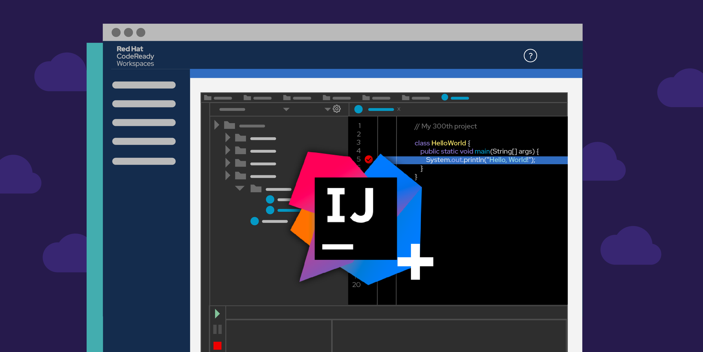

<h3>What's the balance?</h3>
Learning computer science is tricky. On one hand, you have the theory. These are things like algorithms, data structures, and bitwise operators. They are the heavy concepts applicable in every programming language. On the other hand, we have skill. It’s the ability to use these theories to solve real world problems and to collaborate with other people. But as we learn, focusing on one side too much makes us blind to the other. I always thought the balance was right in the middle, but I’ve realized that it leans towards skill. 
<h3>Being knowledgeable but clueless</h3>
	Over this past semester, our class used development environments, including Intellij. It helps you manage project files and gives your code an easy-to-follow structure. This is the first reason why the balance leans towards skill. Because when I first started using it, although I had experience with web development and Javascript, I was absolutely lost. All the knowledge and experience in my head (granted it wasn’t a tremendous amount) was stuck. I had to slowly learn how to apply those concepts into Intellij. Although this was just one case, it’s taught me that software engineering is not only knowing “why” something happens, but also knowing “how” to do it. We used Intellij, meteor, JSFiddle, Semantic UI, and many more. Each of these weren’t to show me new concepts, they were ways to make programming easier. And the reason for getting stuck every time we switched to a new development environment wasn’t because I didn’t know what I needed. I just didn’t know how to do it.
  <h3>Preventing headache</h3>
	In Intellij, or any widely used development environment, there’s a feature called coding standards. Like mentioned before, it helps you keep the code organized, neat, and maybe even color-coded. But this is not all. Coding standards goes beyond looks, and dictates exactly how code should be written. Whether it’s declaring variables at the top of the file, or providing comments in the code to guide the reader/editor, coding standards allows your code to become real-world ready. This was another thing I would trip over occasionally. When first starting to use Intellij, it would tell me lots of “errors” in the way I wrote. It was a pain going back and fixing everything even though I knew my code would work. I didn’t fully appreciate this until we started our final project. We were split into groups and tasked with making an application. In this setting, I had to write code as well as look at and review code. And having a set standard made it so much easier. Our group had 5 people, and if each person wrote code in a unique way, imagine the headache sifting through 5 styles of code trying to locate a problem. 
<h3>Keeping the balance</h3>
	Software engineering is a balance. Just having skill or just having knowledge isn’t enough. It’s the unification of these two that makes a programmer truly great. I’ve always focused more on theory and concepts. But these past few months have made me realize that it’s more skill than knowledge, at least a little bit. More than just development environments and coding standards, pure skill is essential.
