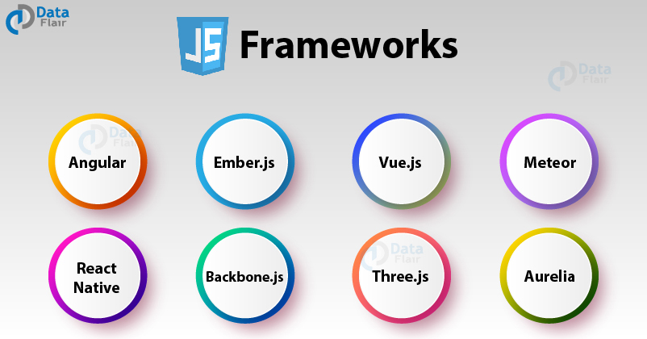

<h3>What's the Point?</h3>
When it comes to programming, the idea of frameworks has always been confusing. I recognized that it was an easier and more powerful way to complete projects, but it was always just as difficult learning the framework as it was learning the original language. So what was the point? Wouldn’t I have just as much luck learning the original code than to learn a framework? Because of this way of thinking, I’ve always preferred to program in vanilla Javascript. When it came to making games or programs, I’ve found it easier to find a way to code it in vanilla than to learn a framework or library, ei. PhaserJS, PixiJS, etc. Even when I look up tutorials or examples, I always respected programmers that used no framework to help them. It was as if they didn’t need an easy way out, but only needed their minds. 

<h3>Using Semantic UI</h3>
This idea however quickly changed once we started using Semantic UI in my current Computer Science course at UH Manoa. It’s a framework for web design, and although there’s tons to learn, even with a basic working knowledge, I was able to replicate entire landing pages within 15 minutes. That’s powerful. And it really opened my mind to the idea of frameworks, and possibly even creating one myself for future projects. I realized that downloading and working with libraries is no different than what I do when I program. For example, I’m currently working on a demonstration of collisions with circles on a screen. I wanted to get a feel for programming physics before building a more complicated model/game. As I began programming however, I realized I’d be needing to use a lot of vectors for calculating direction and speed, but also needed vector operations like the dot product and finding the unit vector or magnitude. That’s when I decided to create a Vector class to handle all of these procedures in a neat and manageable way. This is exactly what a framework is, only scaled up tremendously. It’s just a way to help programmers speed up processes and make things organized while delivering the same and reliable performance and experience. At that point, deciding to stick to vanilla programming for the sake of principles only ends in wasted time and headache.

<h3>The Reality Of It</h3>
At first, programming with frameworks seemed like a cop-out. It was only for weak programmers that couldn’t think of a solution themselves, so they had to find someone else’s code to do it for them. And although this might be true, in some sense, I’ve realized that frameworks simplify processes so much, that it’s borderline stupid not to use them. Why, when given a much more efficient and powerful way to carry out projects, would you take the harder way. Principles? Respect? I care very much about these things, but in the real world, what people care about is results. And frameworks help me do that.
