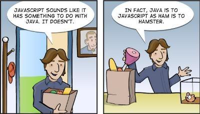
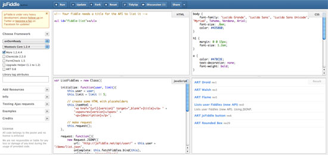

## Javascript and Java
When I first heard about the name Javascript, my first thought was that it must come from Java, and so they must be a lot familiar. After a few lines of code in Javascript, and I noticed that I was completely wrong. Java and Javascript are alike as much as a *car* and a *carpet*, or *ham* and *hamster*. 
### Here are how to say "Hello World" in Javascript:
```
<script>
    alert( 'Hello, world!' );
  </script>
```
### And "Hello World" in Java:
```
public class HelloWorld {

    public static void main(String[] args) {
        // Prints "Hello, World" to the terminal window.
        System.out.println("Hello, World");
    }

}
```
<div class="ui medium rounded images">
	
</div>
## Why I like Javascript
The reason I choose to compare Java and Javascript because Java is the first programming language that I learned, and Javascript is still really new to me. However, I can see that Javascript's syntax is not much different compare to other programming languages that I learned such as C, Java, PHP...I still don't know much about Javascript, but I do want to learn more because I like how convenient it can be use. First of all, the syntax for Javascript is really simple. I can start code right away without include library or adding main function like in Java and C. 

Second of all, unlike most programming languages, I can execute the code in javascript without compiling the code. That can save me a lot of time in case I want to test a new algorithm, or when I want to make a simple calculation. All I need to do is write the code on an online code editor site like [JSFiddle](https://jsfiddle.net), save it, and click **RUN**.
<div class="ui large rounded images">
	
</div>
I'm not saying Javascript can is better than other software development languages, what I means is that Javascript is the language that I think may come in handy when I want to try out a new algorithm.

## Athletic Software Engineering

It's still a new thing for me, and maybe I'm not used to it yet but I think it's a good practice for me to think and solve problem faster.  It's a good exercise for my brain, which is the laziest part of my body. Whenever I need it the most, it's always out of energy.  So I think that if I keep practice this style of learning, maybe I can build up more <i>muscle</i> for my brain. **Is it stressful?** <i>**Hell yeah**</i>, but I believe this is the stress that I need in order to overcome my weakness to achieve my goal and become successful in the future.
<div class="ui medium rounded images">
	
</div>


