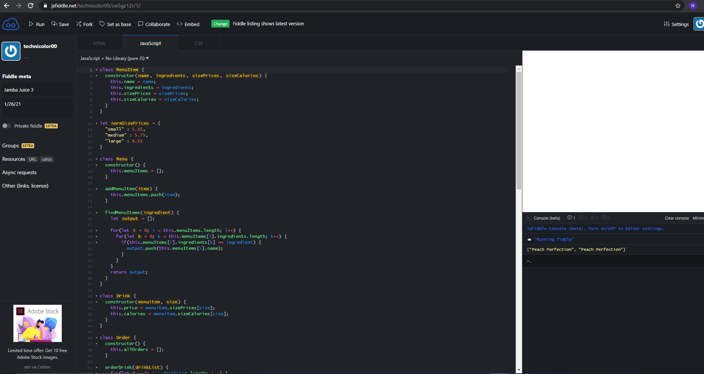

<h3>Initial Thoughts</h3>
Javascript is pretty easy so far, but sometimes the fact that it's so easy sometimes makes it more difficult. For example when writing functions or methods in javascript, you don't have to define what return type it'll have. The function could literally pass anything and return anything. This is really convenient, but it's also kinda confusing sometimes. I have prior experience with javascript because I was really interested in web development. However recently with the UH classes, I've learned Java and C/C++, and both of these are very different from javascript, but they were a lot more organized and concrete. 

<h3>Confusingly Simple</h3>
From a software engineering perspective, I think js can be very powerful, but because it's overly convenient sometimes, it might end up just causing confusion at times. Of course if you're used to it then you'd understand precisely how js works and is compiled and everything, but coming from Java and C/C++, it's just interesting seeing how different it is. 

<h3>Competitive Programming</h3>
Athletic programming is interesting and I think there's lots of benefits. It helps me work under pressure but also focus and hone in on the problem at hand. I also think it's fun trying to find the most efficient solution in the least amount of time. Even if there's no competition, it's nice to have motivation, especially if the coding problem is something I don't particularly want to do. I actually very much like it.
