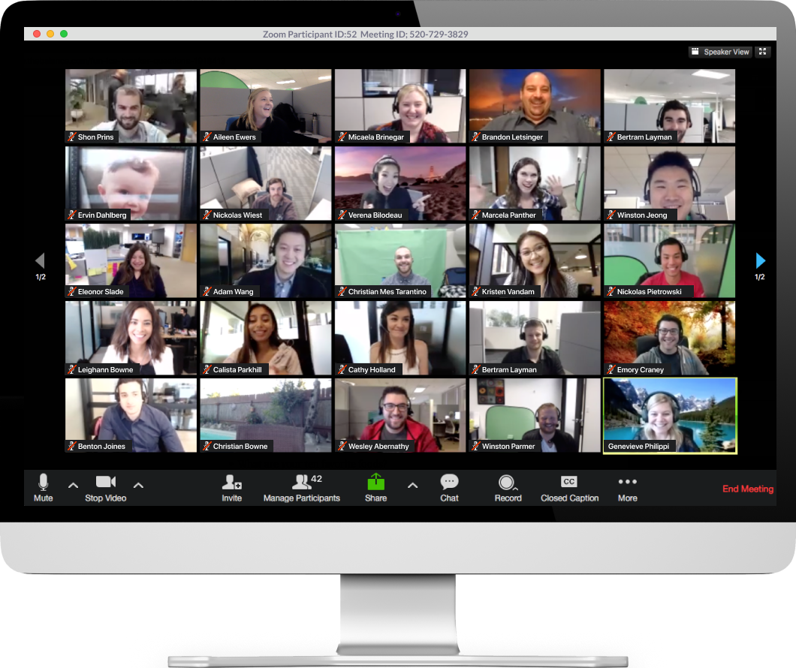

<h3> Learning Programming During a Pandemic </h3>
Computer Science is a unique field, mixing mathematics and technology. It encompasses not only numerical intuition, but intuition on problem solving and teamwork. But with this vast field comes an inherit difficulty. Learning Computer Science is no doubt a daunting task, and without the proper instruction or material, you can get lost pretty quickly. With this pandemic, online learning has become mainstream. Whether you liked it or not, school was now something you log on to rather than drive to. For me, this was okay. It wasn't my preferred method of learning, but I didn't hate it either. There were definitely moments where I wished I could go in person or go to office hours 1-on-1, but sometimes, when you're laying on your bed with your laptop attending class, it's nice. And even in-person programming classes, my eyes and hands are constantly on my laptop, so no real difference there. With our upcoming class, I think online classes are actually more beneficial than in-person classes.
<h3> Advantages and Disadvantages </h3>
Not going to class in person has had the general effect of making people more lazy and less likely to complete their assignments. Staying home all day craving to go out with friends isn't necessarily a motivation to study. But if we look past the initial steps of slow-progress, we can see the many advantages to online classes.
For me, I enjoy going at my own pace. Whether that be faster or slower, my pace was my pace. And so even though online classes would have a schedule, I felt as though I had more responsibility to carry out my own learning. Assuming there's a desire to pass the class, online format allows students to go through material at their own speed rather than hastily trying to scribble down the chalkboard as it gets erased. We can pause lectures and take time to understand, look at future class notes and study ahead. Even communicating with other students is made easier since everyone is accessible online. 
Although this pandemic seems to put a hold on education, I believe its actually accelerated it. By learning to utilize technology, we can actually study more effectively and productively.
