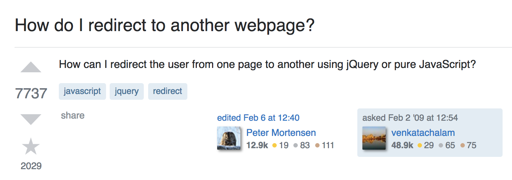
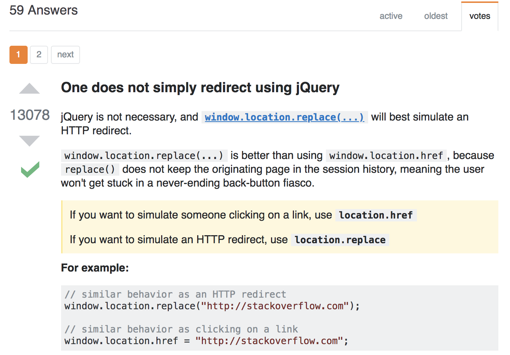
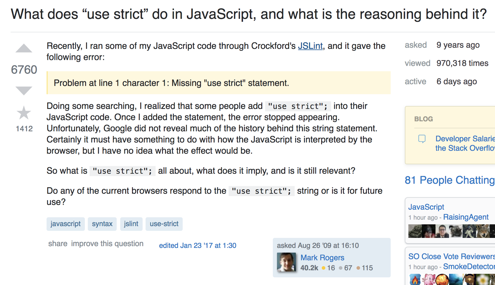

While some may disagree, I personally don't think there is such a thing as a stupid question. Using the word “stupid” overemphasizes the fear of putting yourself out there and getting rejected. Rather, in the scope of asking questions on a tech form, I like to think of it as a spectrum from “smart” questions to “wasted” questions. I say this because the purpose of the question is to get an answer that moves you forward when you’re stuck and acts as a catalyst to your programming problem or project. Thus, a smart question would lead you in that direction while a “wasted” question would not. It is important to ask a smart question not only to ensure you get a helpful answer but to use the decorum of the tech forum community and fit into its culture. 

Below, I will give examples of wasted and smart questions with explanations to help you be more intentional about your posts. These ideas are  inspired by <a href="http://www.catb.org/esr/faqs/smart-questions.html">How to Ask Questions the Smart Way</a> by Eric Steven Raymond. If you are interested to read more on the topic, I would highly suggest checking it out!

### Wasted Question

  
  

There are a number of problems with this question posted on stack overflow. Firstly, if you ask a vague question, you will get a vague answer. From my perspective as a fellow coder, I’m not quite sure what this individual was trying to ask. Are they looking for informative websites where they get a foundation on redirecting on jQuery or JavaScript or did they try to do this in their code but ran into a problem? This ambiguity makes it hard for a fellow hacker to give you a helpful answer that would move you forward in your code. As shown in the response to the question, this individual tried there best to give an general answer but we don’t really know if that was the answer they were looking for. 

Also, not only does the body of the question lack detail, but the title lacks information and a little bit of spunk. It's important to be mindful that these fellow hackers or mentors are answering these questions just to be helpful and maybe be inspired to look at a problem in a new way. Thus, you would want to make the title of the question interesting and informative that would intrigue people to take the time to write you an answer. Finally, if the answer to this question would show up on the first page of Google, you might want to do your due diligence researching there first. Otherwise, you might get the response “STFW” or “Search the Fucking Web”, which has level of aggression that I find a just a little bit funny. 

### Good Question

    

The stack overflow question depicted above is not perfect but has many strengths that I would like to highlight. For one, it is clear that the individual did his research beforehand. He included his diagnostic steps and troubleshooting process which shows that he has made an effort and a sign of respect for the coders and their time. This, along with the inclusion of the error line also helps them understand the problem and give a direct answer. I would note that he could have even improved his question by adding the code that resulted in the error as a minimal test case. I also liked that he wrote that he wanted to know how to use this line of code to solve his problem at hand but also wanted to understand how it works in general. This clarity helps the other coders respond with a useful answer and address the multiple questions he may have on the one topic. 

### Is this question worthy of Dumbledore?

    

I like to think the professionals on stack overflow or any other hacker on a tech discussion Q&A forum as the Professor Dumbledores of the tech world. Or if not Dumbledore, pick any mentor or leader in the field of your choice— Elon Musk, Steve Jobs, Shonda Rhimes, Warren Buffet, Sheryl Sandberg etc. They can be of incredible help to you and also want to take time out of their day to help, which then also deserves a level of R-E-S-P-E-C-T (extra points if you just sang that in your head). Secondly, if you could ask Dumbledore one question to help you find a horcrux, you wouldn’t want to waste your question on directions to the ministry of magic or “what is the deathly hallows?” Given the level of Dumbledore’s experience and knowledge, you don’t want to waste your question on something someone else or Google could answer— which is why I renamed bad questions as wasted questions. 

So before your next post on a tech forum, ask yourself, would I ask Dumbledore this question?
