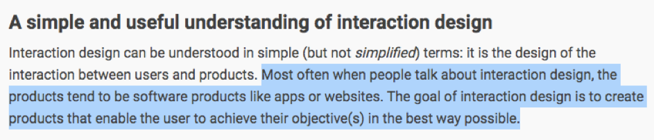

 
I am studying a bachelor-degree in media- and interaction design, and currently I am in Hawaii on exchange. One of the courses I choose to take is software engineering. This course contains programming skills like javascript, application design (UI), databases, project management and testing. If we take a look at a <a href="https://www.interaction-design.org/literature/article/what-is-interaction-design">description </a> of interaction design, we can see that these two disciplines have a lot in common. 

Compared to what software engineering covers, interaction design contains a lot of the same topics but just with different aspects.  
 
<h2>Interaction design in depth</h2>
Software engineering is an interesting field where I can expand my knowledges within programming. By learning more within this discipline, I think it will help me help me becoming a better interaction designer. With knowledge about how to create and implement functionality into web solutions, it will give me a better foundation to improve the user experiences. Today it is a lot of websites and applications that lacks user-friendly solutions, and I hope that I can learn as much as possible, so I can apply this into my future projects, to make the solutions even better. 
 
<h2>Teamwork</h2>
As an interaction designer I have to cooperate with people within different disciplines. To succeed as a team where everyone has different backgrounds and no one knows anything about the others specialty, it is often going to be misunderstandings. By learning something from your colleagues’ fields, it will help prevent lack of understanding and hopefully contribute to better results. 
 
<h2>Conclusion </h2>
By getting a broader understanding of how technology works on digital solutions, it will become easier to see the bigger picture and figure out what is the problem areas. I hope this will help me and my future colleagues to make user friendly solutions that works well. 

