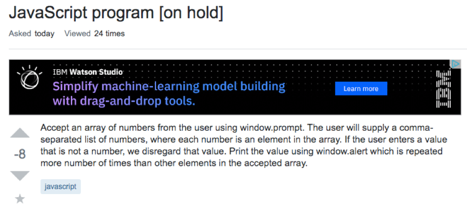
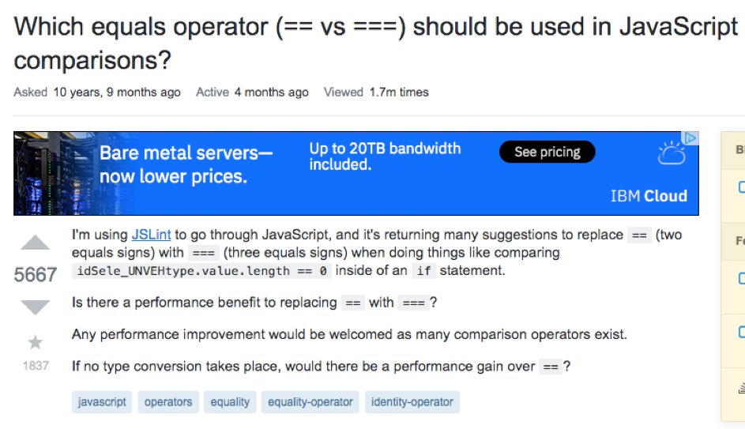

What a brilliant idea! I just post my homework into Stackoverflow, and hopefully someone can solve it for me. 

As far as I´ve understood is the purpose of homework is to learn something. <a href="https://stackoverflow.com/questions/57897741/javascript-program">This </a> question posted on Stackoverflow did not get an answer to the problem because the hackers understood that this was a given exercise.

The question does not have an appropriate heading. It does not say anything about the question that is asked. This will not just make it less interesting, but it will also be harder to search it up in an archive later. As a result of this, a minimal of people can benefit from this channel.

It is clear that this person did not try to solve the problem before he posted it, or at least he did not show what the challenges he encountered along the way (if he tried). The response from the hackers was as follows:

In contrast to this, I found another question which in my opinion is more informative and precise. 

Even if this is a homework or not, the person behind the keyboard is clearly interested in getting a broader understanding of javascript as a program language. The main different in how these two cases are represented, is what they are asking for. In the first example I refer to, the person asks for the solution (or he does not even ask; he posted the assignment). In the second example the person wonders how to improve his code by understanding the difference equal operators.

Not is only this questions more precise, it shows his/hers thoughts about the problem before he requested guidance in a humble way. 

As a result, this question lead to a lot more relevant answer for the person who asked, in addtion to a lot other people who might wonder in the furture. 
