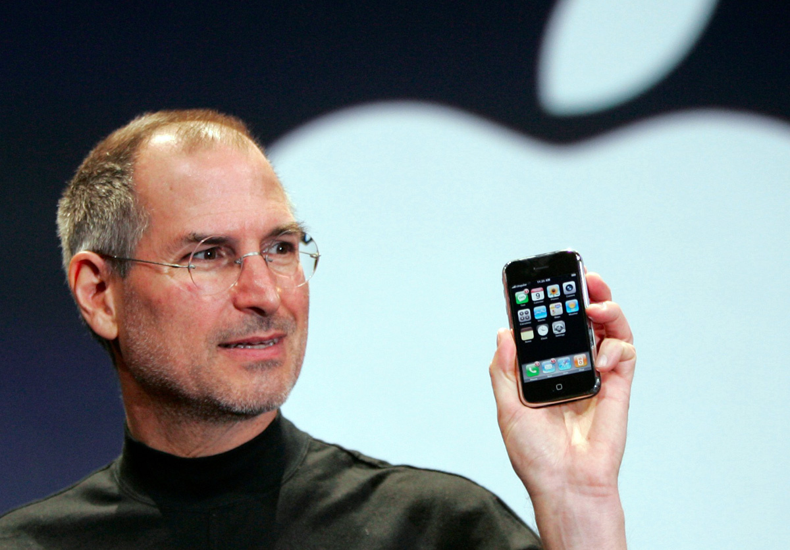
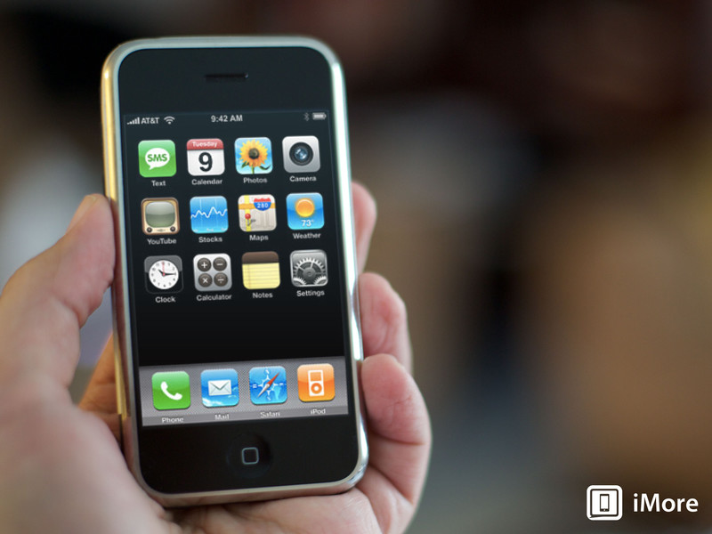
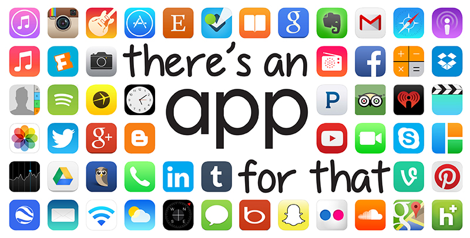

For most people, the most memorable moment for them is probably the first time they met the girl/guy of their dream, but for me it's the first time I had my hand on an iPhone, the first generation iPhone, that I received as a birthday gift from my dad. It was an extraordinary piece of technology that inspired me to become a computer scientist.

My first impression about the iPhone was those tiny icons that called "Apps." Unlike the other phones which I had to click those arrow buttons multiple times in order to find what I need, on the iPhone, all I need to do was touch an icon of the apps that I want to use. The more I used it, the more apps I wanted to have, and there was an AppStore on the phone that I could get those apps from. And because I liked those apps so much, I wanted to be a part of it. I decided I will study computer science, so I can create the apps that I need and share with people who also want to use them.

I am now starting to take a Software Engineering class. I hope to learn a lot through the course, but I know it will be just the beginning of my journey. By the time I’m done with it, I hope I’ve learned enough to take the next step in my life as a developer. My goal is to make softwares that help our life more convenient. You need something? "There is an app for that."

