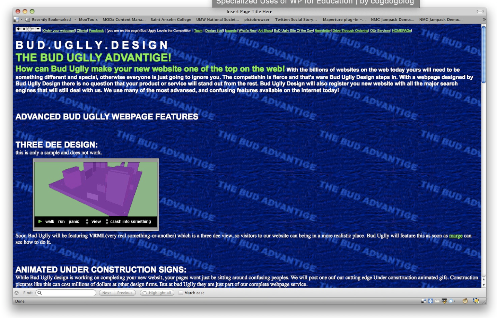

When you hear about a framework, you think it´s going to be easy to adapt and easy to implement. With Semantic UI it is. You can make big differences in a very short amount of lines of code. You don´t have to specify all the different pixels with margins and paddings. 
 
Semantic UI is a very effective tool to easily show a layout of something. By just adding a couple of div´s with a class that specifies the conditions, you can change the whole layout of the webpage. Therefore, I would say that it is a well-suited framework for creating prototypes or just sections of a webpage. 
 
Another good thing about the Semantic UI, is that its components are responsive, and that saves me for a lot of work with making different versions to the different devices. You don´t have to define where the different components are supposed to be located at different devices with different widths. 
 
The documentation for UI semantic is all accessible through their webpage, and therefore is it easy to find what you´re looking for. It is possible to see the code to the different elements, so you can just copy a piece of code and fill in the content you want.
 
The only thing that annoyed me while using the Semantic UI, was to keep track of all the div´s. If one div is in the wrong place, everything gets messed up and it feels like I´m back to 1900. Apart from that, I love Semantic UI, and I doubt that I will go back to normal CSS anytime soon. Semantic UI saves me for a lot of work and time! 

