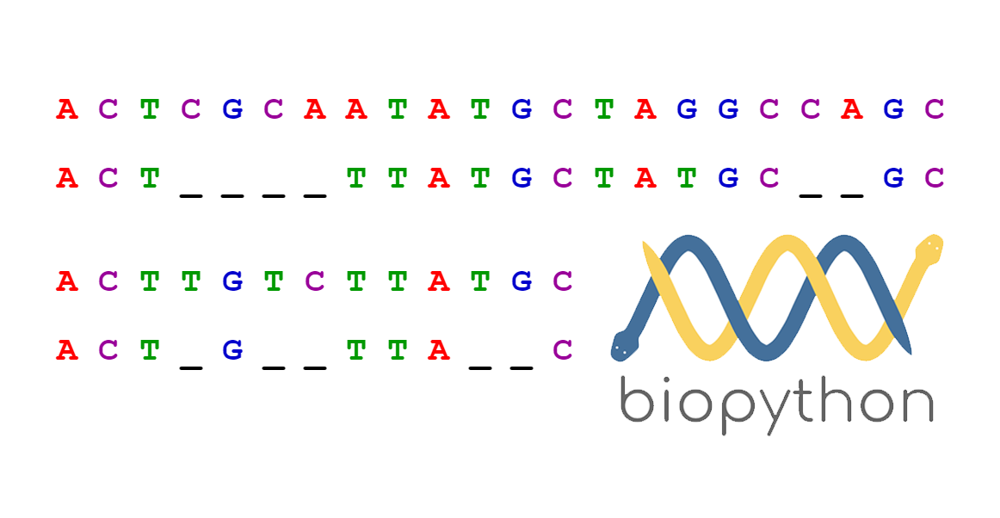

SSR Finder is a Python script I wrote to assist a grad student in my research lab, in Spring of 2018. It taught me how to program in the Python language and its bioinformatics library Biopython. It also gave me the opportunity to not do everything below by hand (which is what the grad student was doing).

SSR Finder is intended to work in conjunction with the MISA perl script which simply counts the number and types of Simple Sequence Repeats (SSRs) in a given text file. My script functions as a pipeline of discrete modules that can be used to: parse the output file of MISA for desired SSR types, find their locations on their respective host sequence above a given size, use the BLAST algorithm to find the host sequence's closest protein homolog, graph the hydrophobicity of the amino acids that the SSRs code for, log that protein's functional domain (if any), and log all this information in a spreadsheet. 

This program, assuming every module is used and using online BLAST, will take around 8 hours with a ~600 sequence input. If using a local BLAST database then the time will be more like 45 min with 1200 sequences.

Doing this project made me very comfortable with text parsing in Python, especially using [BioPython](https://biopython.org/) for its BLAST wrapper and NCBI Entrez module. It also taught me baby's first basics in command line in unix, and data managment skills when dealing with text files > 3Gb in size.

I would like to come back to my comment about what the grad student was doing, as he literally was using "command F" in notepad and 5 web browsers open as he did everything else sequence by sequence. I would also like to point out that there were easily over 600 sequences, and each one took around 5-10 minutes depending if your computer crashed or your internet was good. I'm glad I knew how to program so I did not have to do that, and its why I encourage everyone to at the very least take an intro to programming class if you do research.
