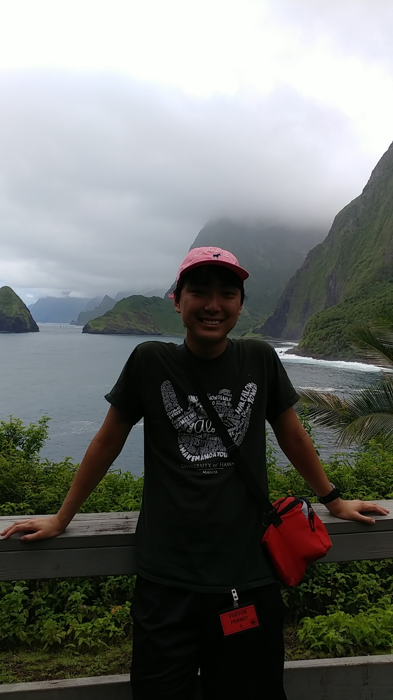

  
  

Kalaupapa is a small area of land located on the northern edge of Moloka'i. I was once the place where people who had contracted or had thought to had contracted leprosy were sent. It was a relatively small community, but it was tightly knit, and isolated for fear of the spread of the disease. As one might expect, this was extremely cruel to those affected, especially for children who were often ripped from their families and sent to the small penninsula to live out the rest of their lives. Nowadays the town is filled mostly with the dscendents of those who were exiled and visitors who come to pay respects to their ancestors.

For my ambassadorship for my college, we were given the opportunity to travel to Kalaupapa and work on clearing a field for a monument for those who were exiled. The people in the town were estatic that a group of young, able bodied people were willing to do work in service to their loved ones. It was rewarding work, the townspeople were welcoming hosts and we got to bond together as a group. It was another time when teamwork really did make everything better. Now, instead of working in the hot sun doing menial work, it was a bunch of newly minted friends collaborating on a singular goal. We learned to work out internally who to delegate work to and how we would do the work. We learned our strengths and weaknesses and even used that when preparing our meals. We used the time on our trip to go from a bunch of college kids to really our own little family, and it was easily one of the best "group projects" I've ever worked on.
 

