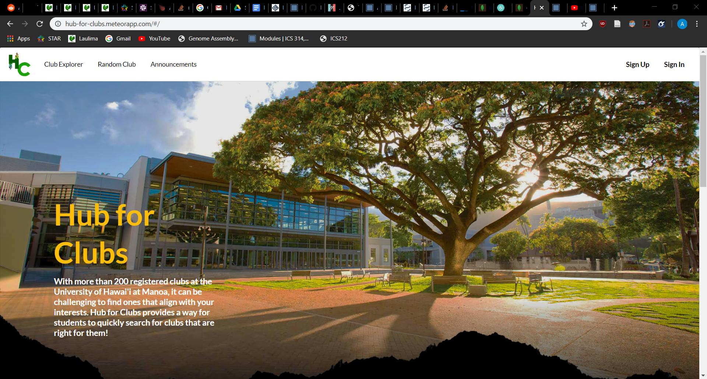
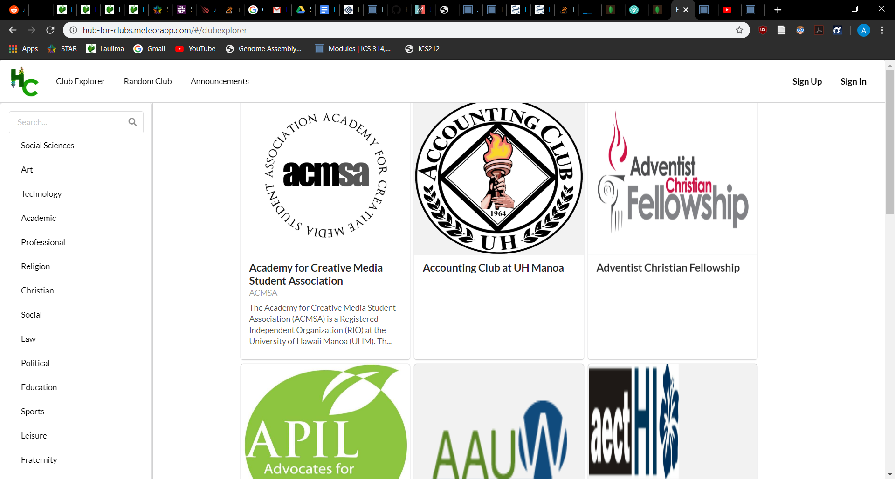
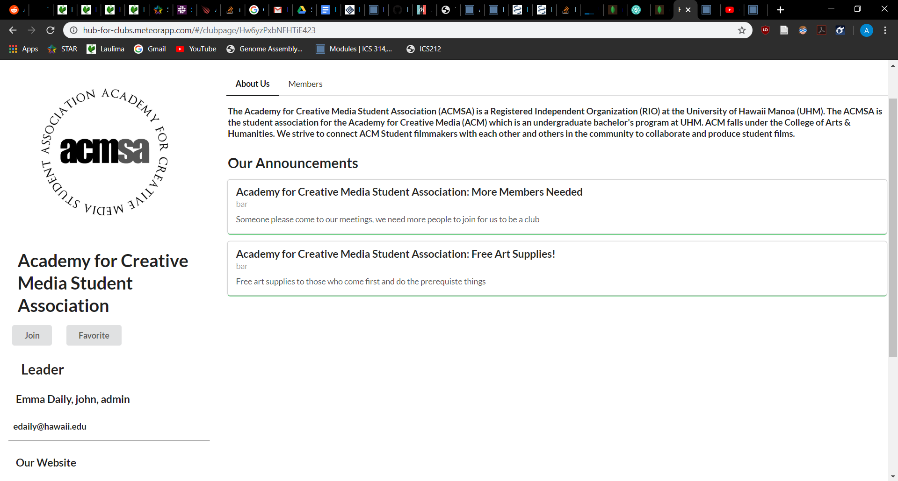

The link to the Organization page for more info: [https://hub-for-clubs.github.io/]

For my final project for ICS 314, myself and a few of my partners created an app for use by UH Manoa club leaders to help students discover and participate in new clubs. It was fairly limited in function due to what we wanted to achieve with the project, but it mostly had to do with the discovery of clubs. The current way to do it is a simple spreadsheet with contact info and links to their websites, so we tried to make a more inviting way to look for organizations that students would be interested in.

This is why we made a system for the reccomendation of clubs based on their interests, alongside member lists with their majors to see if the demographics of the organizations fit what they were comfortable with.
In my opinion the biggest reason to use the site is how much more friendly it is to users instead of seeing a large spreadsheet with links.

When working, I handled a lot of the back end things like handling the schemas, cleaning up a lot of the default data, and setting up the form submissions to handle the changing of the pages. It was fairly frustrating, and it was a very different flavor of annoying when an error appeared. Instead of seeing a button not be centered correctly, it was instead that the console was telling me that there was an element that was undefined when in the console you could clearly see its value. A lot of what I learned had to do with figuring out how the pages communicated with eachother, subscriptions, and also managing the workflow between partners. We had to be fairly specific when talking in order to prevent conflicts which happened more than I would have liked. However, in the end I am fairly happy with what we produced given the strict timeline, heavy workload, and difficulty meeting with eachother.
