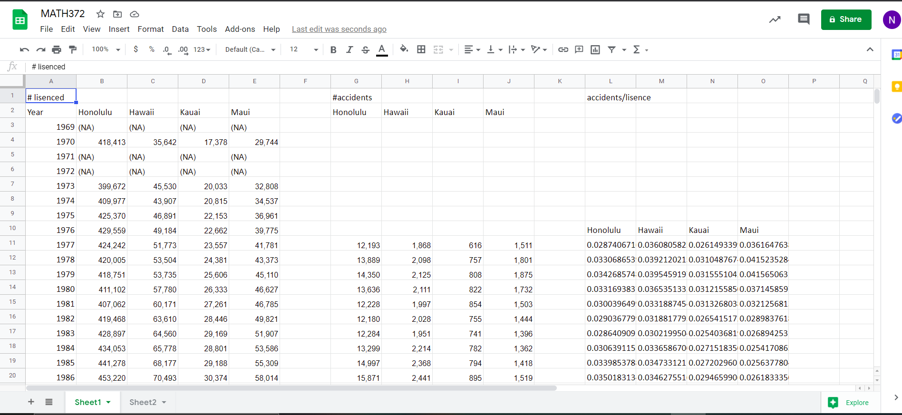

  

This was the second ever project of my coding career! This was our final project that we were supposed to create for the final quarter of the semester. After being confined to the strict stickerbook rubric, our professor finally let us expand to something we really wanted to create. Our project could literally be whatever we wanted (although he had to review it and decide if it was worthy of course). When I was little I always liked playing concentration, match em ups, or whatever you want to call it and I thought it would be a really cool game to make.

In this project, we were put into groups, so we could see how a teammate based project would really feel like, since in the real world this is how projects would be like. It was an extremely fun experience, my first and only computer science group project to this day. In this project, I was the leader, I would organize the group meetings, as well as decide what each person would program/do. I created the loop that would randomize the cards every time the game would load. 

Conclusively, this project was another important milestone in helping me become a better leader and a better programmer. I had to learn to be patient with people, not everyone has the same work ethic, some have other important things to do, but it’s important to find a way to have everything work out smoothly. It was a profusion of fun and learning to code with some friends and group mates and I really felt like I was getting some experience that may help me in a real world work environment some day.
